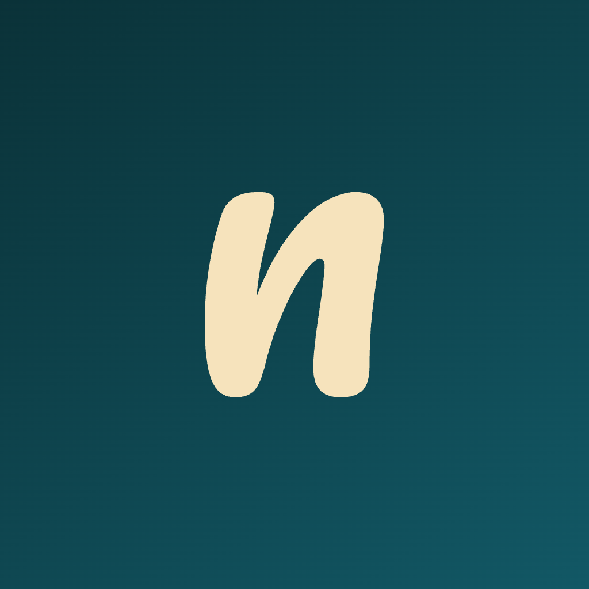

# Note Nerds

<p align="center">
  
</p>

Note Nerds is a native, local-first notebook and drawing app for iPad. It combines an infinite canvas, Apple Pencil input, inline text, searchable handwriting, layered content, and a folder-based library in an interface built with standard iPad patterns.

The app is written in Swift 6 with SwiftUI, UIKit, PencilKit, Vision, PDFKit, and CloudKit. Its document model belongs to Note Nerds rather than any Apple persistence or drawing framework, which keeps notebooks editable, versioned, and portable.

Note Nerds is under active development. The complete product direction and engineering requirements are in [the product specification](docs/full-specification.md).

Build and App Store release instructions are in [the deployment guide](docs/deployment.md). Finished App Store copy is in [the App Store listing](docs/app-store-listing.md), and the release command is documented in [scripts/README.md](scripts/README.md).

## Current capabilities

### Library and organization

- Collapsible iPad sidebar with My Notebooks, Favorites, Recents, and Trash.
- Nested folders and root-level notebooks.
- Notebook previews in the detail pane.
- Drag notebooks from the detail pane into folders or Trash.
- Multi-item move, Trash, restore, permanent deletion, and empty Trash actions.
- Notebook and folder favorites, tags, and configurable sorting.
- Inline notebook-title editing in the notebook navigation bar.
- Dashed notebook previews in Trash.

### Canvas and documents

- Multiple infinite canvases in each notebook.
- Canvas creation, duplication, deletion, reordering, and thumbnail browsing.
- Pan, zoom, return home, zoom to content, and an optional minimap.
- A visual paper gallery with blank white, blank cream, large and small grids, large and small dots,
  yellow legal pad, and white legal pad choices.
- A saved default paper choice, plus paper changes from each canvas thumbnail's context menu.
- Explicit layers with naming, ordering, visibility, object movement, and deletion.
- A spatial index that limits expensive canvas queries to relevant content.
- Canonical editable objects for strokes, shapes, text, images, and PDF pages.

### Drawing and editing

- Ballpoint, fineliner, mechanical pencil, pencil, marker, highlighter, brush, and calligraphy tools.
- Five visual width choices and per-tool width and color memory.
- Color presets, a system color picker, and two saved tool favorites.
- Object and precision erasers that preserve vector content.
- Lasso selection across layers with move, resize, rotate, copy, cut, paste, duplicate, delete, and move-to-layer actions.
- Draw-and-hold recognition for lines, arrows, rectangles, squares, circles, ellipses, and triangles.
- Operation-based undo and redo with exact object restoration.
- Vertical or horizontal floating editing tools, including left-handed placement.

### Text and handwriting

- Text creation and editing directly on the canvas.
- Every font available to the app through the iPad system font catalog.
- Font size and alignment controls beside the active text.
- Return to commit and Escape to cancel inline text editing.
- On-device handwriting recognition through Apple Vision.
- Searchable handwriting that preserves the original ink.
- Handwriting-to-text writing mode and lasso-to-text conversion.
- Search across notebook names, typed text, recognized handwriting, PDF text, and tags.

### Import, export, and sync

- PDF and image import with bounded input sizes.
- PDF, PNG, and native editable notebook export.
- Versioned `.notenerds` packages containing deterministic document data and original assets.
- Local snapshots and an operation journal for recovery after an interrupted write.
- Local-first autosave. Drawing and editing continue when iCloud is unavailable.
- Private CloudKit synchronization with incremental changes, retry state, assets, cursors, tombstones, and deterministic conflict handling.
- A provider protocol that keeps CloudKit types out of the domain model.

### iPad integration and accessibility

- Apple Pencil, Apple Pencil Pro, finger, keyboard, and trackpad input.
- Apple Pencil hover, double tap, squeeze, barrel-roll data, and a squeeze radial menu where hardware supports them.
- Portrait, landscape, multitasking, Stage Manager, Files, Share Sheet, drag and drop, and system clipboard support.
- VoiceOver labels, values, and hints for standard controls and meaningful canvas state.
- Dynamic Type for application interface text.
- Reduce Motion support for the radial menu.
- Hardware keyboard commands for common document and editing actions.

## Requirements

- macOS with Xcode 16 or newer. Development is currently verified with Xcode 26.6.
- An iPad simulator or physical iPad running iPadOS 18 or newer.
- [XcodeGen](https://github.com/yonaskolb/XcodeGen) 2.45 or newer when regenerating the Xcode project.
- [SwiftLint](https://github.com/realm/SwiftLint) 0.63 or newer for the strict style check.
- An Apple Developer account and a CloudKit container for device sync testing.

There are no third-party runtime dependencies. XcodeGen and SwiftLint are development tools.

## Quick start

Clone the repository and enter its directory:

```sh
git clone <repository-url>
cd note-nerds
```

Install the development tools with Homebrew if needed:

```sh
brew install xcodegen swiftlint
```

Generate the Xcode project:

```sh
xcodegen generate
```

Open the app:

```sh
open NoteNerds.xcodeproj
```

In Xcode, choose the `NoteNerds` scheme and an iPad simulator, then run the app.

The checked-in Xcode project is generated from `project.yml`. Treat `project.yml` as the source for project structure and build settings, then regenerate the project after changing it.

## Command-line build

List the available simulator names:

```sh
xcrun simctl list devices available
```

Build for the latest iPad Pro simulator:

```sh
xcodebuild build \
  -project NoteNerds.xcodeproj \
  -scheme NoteNerds \
  -destination 'platform=iOS Simulator,name=iPad Pro 13-inch (M5),OS=latest' \
  -derivedDataPath /tmp/NoteNerdsDerivedData
```

The project enables Swift 6 strict concurrency and treats Swift, Clang, and GCC warnings as errors.

## CloudKit setup

The project currently uses these identifiers:

```text
Bundle identifier: com.strategicnerds.notenerds
CloudKit container: iCloud.com.strategicnerds.notenerds
```

Contributors who need device sync must use identifiers owned by their Apple Developer team:

1. Change `PRODUCT_BUNDLE_IDENTIFIER` in `project.yml`.
2. Change the iCloud container in `NoteNerds/NoteNerds.entitlements`.
3. Enable iCloud and CloudKit for the app identifier in the Apple Developer portal.
4. Create or select the matching CloudKit container.
5. Regenerate `NoteNerds.xcodeproj` with `xcodegen generate`.
6. Select a valid development team in Xcode.

Simulator and test runs use local storage without constructing the production CloudKit container. A missing iCloud account or temporary CloudKit failure does not stop local editing.

## Architecture

Dependencies follow this direction:

```text
SwiftUI and UIKit views
          |
          v
Application state and use cases
          |
          v
Framework-light domain model
          ^
          |
Local storage, import/export, Vision, PencilKit, and CloudKit adapters
```

### Domain

`NoteNerds/Domain` defines the application-owned model and behavior:

- Library, folder, notebook, canvas, layer, and content types.
- Geometry, viewport transforms, spatial indexing, and minimap mapping.
- Drawing tools, strokes, selection, shape recognition, and vector erasing.
- Document operations and history.
- Search and handwriting metadata.
- Synchronization changes, cursors, conflicts, and provider contracts.

Domain types do not depend on SwiftUI, CloudKit records, or PencilKit archives.

### Application

`NoteNerds/Application` coordinates user actions and state:

- Library and notebook workflows.
- Editing operations and history.
- Document checkpoints and journal writes.
- Search-index updates and recognition tasks.
- Change encoding and synchronization scheduling.

`AppModel` is isolated to the main actor. Long-running recognition, persistence, and synchronization work uses Swift concurrency.

### Infrastructure

`NoteNerds/Infrastructure` contains framework adapters and file access:

- Local library metadata, notebook snapshots, and operation journals.
- Deterministic native serialization and `.notenerds` package archives.
- PDF and image import.
- PDF and PNG export.
- On-device Vision handwriting recognition.
- CloudKit and in-memory sync providers.
- Bounded file reading and archive path validation.

### User interface

`NoteNerds/UI` contains the SwiftUI application structure and focused UIKit or PencilKit bridges:

- Native split-view library and collapsible sidebar.
- Notebook navigation, canvas browser, and floating tool palette.
- PencilKit canvas input and canonical stroke conversion.
- Selection, text, search, minimap, and object overlays.
- Visual tool inspectors and system font selection.

## Document format and persistence

The public notebook extension is `.notenerds`. Each package contains:

```text
Notebook.notenerds/
├── Document.json
├── Manifest.json
└── Assets/
    └── <asset UUID files>
```

`Document.json` contains the versioned canonical notebook model. `Manifest.json` maps asset identifiers to their files. The current document schema is version 3.

Serialization uses sorted JSON keys and millisecond timestamps for deterministic output. Newer unsupported schema versions are rejected before document data is changed. Older supported documents are migrated to the current schema. Archive reads validate asset names, constrain file sizes, and reject paths outside the package asset directory.

During editing, Note Nerds writes notebook checkpoints and operation journal entries under Application Support. Assets are stored separately from frequently updated library metadata. The app checkpoints active documents when it leaves the active scene phase.

## Synchronization

`SyncProvider` defines start, push, pull, asset upload, and asset fetch operations. Version 1 uses the user's private CloudKit database through `CloudKitSyncProvider`.

The sync path supports:

- Incremental document and library changes.
- Idempotent delivery and cursor-based pulls.
- Offline queues that persist across app restarts.
- Batched CloudKit writes.
- Recoverable deletion tombstones.
- Independent asset transfer.
- Deterministic timestamp, device, and sequence conflict resolution.
- User-facing account, quota, service, and persistent failure states.

Local files remain authoritative for immediate interaction. Search, drawing, opening notebooks, and undo continue offline.

## Privacy and security

- Handwriting recognition runs on the device with Apple Vision.
- V1 sends no handwriting to third-party AI services.
- Cloud sync uses the user's private CloudKit database.
- Temporary CloudKit asset files use complete file protection.
- Importers reject oversized input before reading it into memory.
- Native archives reject unsafe asset paths and constrain total asset size.
- Tests and simulator runs do not access the production CloudKit container.
- Secrets and local environment files are excluded by `.gitignore`.

Before distributing a build, configure and review the CloudKit container, signing identity, privacy disclosures, and App Store privacy details for the distributing organization.

## Testing

The project uses XCTest with behavior-focused domain, infrastructure, UI, and performance suites.

Run every test target:

```sh
xcodebuild test \
  -project NoteNerds.xcodeproj \
  -scheme NoteNerds \
  -destination 'platform=iOS Simulator,name=iPad Pro 13-inch (M5),OS=latest' \
  -derivedDataPath /tmp/NoteNerdsDerivedData
```

Run the strict style check:

```sh
swiftlint lint --strict --no-cache --config .swiftlint.yml
```

The test targets cover:

| Target | Scope |
| --- | --- |
| `NoteNerdsTests` | Domain behavior, persistence, serialization, import/export, handwriting, search, and sync |
| `NoteNerdsUITests` | Critical library, canvas, drawing, inline text, Trash, drag-and-drop, and settings workflows |
| `NoteNerdsPerformanceTests` | Spatial queries, history, search indexing, decoding, viewport updates, and PDF work |

Tests gather code coverage. Domain tests are parallelizable. UI and performance tests run serially where shared simulator state or measurement stability requires it.

## Project structure

```text
NoteNerds/
├── App/                    App entry point
├── Application/            State and use-case coordination
├── Domain/                 Canonical document and library model
├── Infrastructure/         Files, import/export, recognition, and sync adapters
├── Resources/              Asset catalog and app icon
└── UI/                     SwiftUI, UIKit, and PencilKit interface code
NoteNerdsTests/               Behavior and integration tests
NoteNerdsUITests/             End-to-end iPad workflows
NoteNerdsPerformanceTests/    Performance checks
docs/full-specification.md  Product and engineering specification
project.yml                 XcodeGen project definition
```

## Development principles

The project follows these rules:

- Write a failing behavior test before production code.
- Work in small red, green, refactor steps.
- Keep the document model independent from storage and Apple framework representations.
- Keep drawing and local editing independent from network availability.
- Preserve original ink during recognition.
- Treat accessibility, data durability, performance, and security as feature requirements.
- Keep files and types focused, remove dead code, and refactor after tests pass.
- Compile with strict concurrency and warnings treated as errors.

The full rules and product requirements are in [docs/full-specification.md](docs/full-specification.md).

## Contributing

Contributions are welcome.

1. Read the [full specification](docs/full-specification.md) and the relevant tests.
2. Open an issue for large product or architecture changes before implementation.
3. Add or change a behavior test and confirm the expected failure.
4. Implement the smallest complete change.
5. Refactor while the tests protect behavior.
6. Run the affected tests, the full test suite, SwiftLint, and a simulator build.
7. Submit a focused pull request that explains the user-visible behavior and verification performed.

Do not commit signing credentials, provisioning profiles, CloudKit secrets, local settings, build products, simulator data, or DerivedData.

## License

Note Nerds is released under the MIT License.
