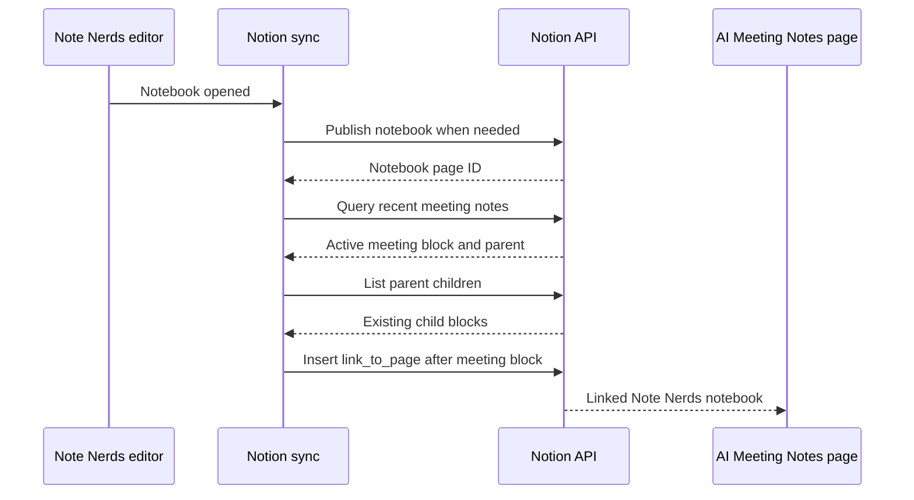

# Notion AI meeting note links

Status: Research complete. Live permission check and implementation remain.

Date: August 9, 2026

## Requested behavior

When these conditions are true:

1. A notebook is open in Note Nerds.
2. Notion sync is connected and has a destination.
3. Notion AI Meeting Notes is recording a transcript for the connected user.
4. The open notebook has a synced Notion page.

Note Nerds adds a link from the active Notion AI meeting note to the synced notebook page in Notion.

The link gives the meeting transcript and the handwritten notebook an explicit relationship without copying transcript text or audio into Note Nerds.

## Feasibility

Notion API `2026-03-11` supports this feature.

- [`POST /v1/blocks/meeting_notes/query`](https://developers.notion.com/reference/query-meeting-notes) returns meeting-note blocks for meetings where the user tied to the connection is an attendee.
- Each result contains a lifecycle status. Relevant values include `transcription_in_progress`, `transcription_paused`, `summary_in_progress`, and `notes_ready`.
- Each result includes the meeting block ID, parent information, recording times, and optional summary, notes, and transcript child IDs.
- [Meeting-note blocks are read-only](https://developers.notion.com/reference/block). Their parent can accept another child block when the connection has access and insert-content permission.
- [`PATCH /v1/blocks/{parent_id}/children`](https://developers.notion.com/reference/patch-block-children) can insert a link directly after the meeting-note block with a `position` of `after_block`.
- A `link_to_page` block can point to the synced Note Nerds notebook page by page ID. A linked rich-text page mention is a fallback if live testing finds a presentation problem with `link_to_page`.

The current app already sends `Notion-Version: 2026-03-11` and has read, insert, and update capabilities. No new secret or hosted service is required.

## Permission constraint

Public Notion connections receive access to pages selected during OAuth or shared later through Notion. The meeting-notes query requires read content. Inserting the notebook link requires insert access to the meeting block's parent.

The first implementation check must use the existing Note Nerds OAuth token during a live recording and answer these questions:

1. Does the query return the active meeting when its page was not selected during Note Nerds setup?
2. Does insertion after the meeting block succeed?
3. If insertion returns `403`, does sharing the meeting page or its parent database with Note Nerds grant inherited access to future meeting notes?

If sharing is required, Settings should add a short setup row named `AI Meeting Notes links` with a status and instructions for sharing the meeting-notes parent with Note Nerds. Reauthorization should remain unnecessary when Notion's existing `Add connections` action grants access.

## Recommended user experience

### Automatic case

1. The user opens a notebook.
2. Note Nerds confirms that Notion sync is connected.
3. Note Nerds publishes the notebook immediately if it has no current Notion binding.
4. Note Nerds queries active meeting notes.
5. Exactly one meeting has status `transcription_in_progress`.
6. Note Nerds inserts a direct page link after the AI Meeting Notes block.
7. A short confirmation says `Linked to the active Notion meeting note.`

The confirmation should not interrupt writing or require a dialog.

### Several active meetings

If more than one active or paused meeting is returned, show a compact chooser with meeting title and start time. The user can select one or choose `Not now`.

### No access

If Notion returns `403`, show one quiet action in Settings that explains which meeting-notes page or database must be shared with Note Nerds. Do not show repeated alerts while the user writes.

### Notebook changes during one meeting

Each notebook opened during the same recording may add its own link. Switching from one notebook to another does not remove the earlier link.

## Detection and timing

The native app has no public webhook receiver. Foreground polling is the smallest design that matches the request.

- Query immediately after a notebook opens.
- Query every 30 seconds while the editor is open, the app scene is active, and Notion remains connected.
- Pause when the app enters the background, the notebook closes, or Notion disconnects.
- After a link is created, keep a slower two-minute check so a new recording can be found without reopening the notebook.
- Cancel every pending task when the editor identity changes.

The query endpoint allows a limit of 50 and does not use cursor pagination. Request the 10 most recently edited meetings and inspect active statuses first.

## Duplicate prevention and deletion

Use both local association state and a remote check.

```swift
struct NotionMeetingNotebookLink: Codable, Equatable, Sendable {
    let meetingBlockID: String
    let notebookID: String
    let notebookPageID: String
    let linkBlockID: String
    let createdAt: Date
    var wasRemovedByUser: Bool
}
```

Before insertion:

1. Check the saved association for the meeting-block and notebook pair.
2. List the meeting parent children and look for a `link_to_page` block targeting the notebook page.
3. Insert only when neither check finds an existing relationship.

If the user deletes the link in Notion, Note Nerds should respect that choice. A later scan may mark the saved association as removed and should not recreate it automatically. Settings or a notebook action can offer `Link again` later.

When Empty Trash permanently deletes the Note Nerds notebook and trashes its Notion page, Note Nerds should also trash any link blocks recorded for that notebook. Moving the notebook into recoverable app Trash should keep the meeting link.

## API sequence



## Current code map

| Area | Current file | Required change |
| --- | --- | --- |
| API version and requests | `NoteNerds/Notion/API/NotionAPIClient.swift` | Add meeting-note query, block retrieval, parent-child listing, insertion, and link deletion requests. |
| API response types | `NoteNerds/Notion/API/NotionAPIModels.swift` | Add meeting status, parent, recording window, and link-block types. |
| Durable state | `NoteNerds/Notion/Sync/NotionSyncState.swift` | Move to schema version 2 and persist meeting-to-notebook link records. |
| Sync registry | `NoteNerds/Notion/Sync/NotionSyncRegistry.swift` | Add idempotent association lookup, save, removed-by-user, and notebook cleanup operations. |
| Feature coordinator | New `NoteNerds/Notion/Sync/NotionMeetingLinkCoordinator.swift` | Choose eligible meetings, confirm the notebook binding, prevent duplicates, insert links, and classify failures. |
| App state | `NoteNerds/Notion/UI/NotionIntegrationModel.swift` | Start and stop foreground detection, provide chooser state, and expose a permission status. |
| Editor lifecycle | `NoteNerds/UI/RootView.swift` and notebook editor lifecycle | Send open notebook and scene activity changes to the integration model. |
| Permanent deletion | Current Notion reconciliation path | Trash saved meeting link blocks when Empty Trash removes the notebook page. |

The feature should stay separate from `NotionSyncCoordinator`. Notebook publishing and meeting-note linking have different triggers and retry rules, while both use the same API client, credential refresh wrapper, and sync registry.

## Test plan

### API behavior

- Query uses `/v1/blocks/meeting_notes/query`, API version `2026-03-11`, descending time order, and a bounded limit.
- Response decoding accepts every documented status and missing optional metadata.
- Insertion uses the returned parent ID and places one `link_to_page` block after the meeting-note block.
- `400` for unavailable AI Meeting Notes and `403` for missing page access map to distinct app states.
- Rate limits and token refresh use the existing Notion request rules.

### Product behavior

- Opening a synced notebook during one active recording creates one link.
- Opening an unsynced notebook publishes it before creating the link.
- Repeated polls never create duplicates.
- Relaunch never creates duplicates.
- Opening two notebooks during one recording creates one link for each notebook.
- Several active meetings require user selection.
- Backgrounding, closing the notebook, or disconnecting cancels polling.
- Manual remote link deletion is respected.
- App Trash keeps the link. Empty Trash removes it.
- No transcript text or audio enters Note Nerds persistence or logs.

### Live acceptance

- Start AI Meeting Notes in the connected workspace.
- Open a Note Nerds notebook on iPad.
- Confirm the link appears beside the recording block within 45 seconds.
- Open the link and confirm it reaches the correct synced notebook page.
- Open a second Note Nerds notebook and confirm both links remain.
- Close and reopen Note Nerds and confirm no duplicates appear.
- Remove one link in Notion and confirm the app does not restore it automatically.
- Repeat with the meeting page outside and inside a parent shared with Note Nerds.

## Implementation order

1. Live permission and insertion check with the existing OAuth connection.
2. API contract tests and response types.
3. Durable association behavior and migration tests.
4. Meeting-link coordinator behavior.
5. Editor lifecycle and minimal confirmation interface.
6. Permanent-deletion cleanup.
7. Full simulator, physical iPad, and connected-workspace acceptance.

## Decisions needed before implementation

1. Confirm whether a deleted Notion link should remain deleted. The recommendation is yes.
2. Confirm whether a paused recording counts as active. The recommendation is to include it for five minutes and show it in the chooser.
3. Confirm the setup wording if the meeting-notes parent must be shared with Note Nerds.
