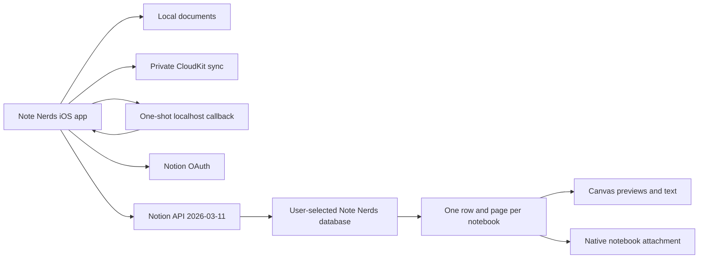

# Notion integration implementation plan

Status: Implemented locally. Live workspace verification is pending.

Date: August 8, 2026

## Objective

Add an optional Notion connection to Note Nerds. A user authorizes a public Notion connection, chooses a parent page, and creates a Note Nerds database in that location. Every notebook maps to one database row. The row's page contains its canvases, searchable text, previews, and an attached native notebook file. The `Folder` property records the notebook's parent folder.

Local documents and CloudKit remain the primary Note Nerds storage. Notion provides a user-directed copy that supports browsing, search, sharing, and restore.

## Product decisions

1. One Notion row represents one Note Nerds notebook.
2. Canvases remain inside the notebook page.
3. `Folder` contains the full readable folder path.
4. `Folder ID` contains the stable Note Nerds folder identifier.
5. A companion library-manifest page preserves empty folders and folder metadata.
6. The attached native notebook file preserves exact editable content.
7. The page body is generated content owned by Note Nerds.
8. Version 1 sync moves from Note Nerds to Notion and supports restore into Note Nerds.
9. Notion edits to notebook content, folder paths, and tags remain outside the version 1 import path.
10. Users can disconnect Notion without deleting their Notion pages.

## User experience

### Connect

1. Open App Settings.
2. Choose Notion.
3. Choose Connect to Notion.
4. Complete authorization in the system browser.
5. Select the Notion pages that Note Nerds may access.
6. Choose the parent page for the Note Nerds database.
7. Confirm Create Note Nerds Database.

The settings screen shows the connected workspace, destination, last sync result, and any action needed.

### Sync

- `Sync now` publishes every changed notebook and the library manifest.
- Automatic sync runs after a notebook closes and after a short idle period.
- A transient failure records its next attempt time and retries automatically without another edit or app restart.
- A notebook context menu includes `Sync to Notion` and `Open in Notion`.
- Progress shows connection, destination creation, sync, restore, disconnect, and action-needed states.
- Local editing continues during a Notion failure.

### Restore

1. Open Notion settings.
2. Choose Restore from Notion.
3. Review the notebooks and folders available from the selected database.
4. Choose missing notebooks or newer Notion copies.
5. Confirm restore.

Restore validates the native archive, schema version, file bounds, content hash, and stable identifiers before modifying the local library.

Notion file URLs are temporary. Restore reads the database rows, fetches each page again immediately before download, and uses the fresh URL. It computes SHA-256 over the downloaded bytes and requires an exact match with the row's `Content Hash` before decoding the archive.

### Disconnect

- Disconnect removes local OAuth credentials and stops sync.
- Existing Notion pages remain in the user's workspace.

## System architecture

### iOS components

- `NotionConnection`: workspace and bot identity returned by OAuth.
- `NotionCredentialStore`: Keychain-backed access and refresh token storage.
- `NotionOAuthClient`: starts authorization, validates the localhost callback, exchanges codes, refreshes tokens, and revokes credentials.
- `NotionAPIClient`: typed Notion REST requests using API version `2026-03-11`.
- `NotionDestination`: selected parent page, database ID, data-source ID, and manifest-page ID.
- `NotionNotebookBinding`: stable mapping between a notebook ID and a Notion page ID.
- `NotionExportPlanner`: produces properties, blocks, previews, files, and content hashes.
- `NotionArchiveCodec`: produces and validates a single native transport file.
- `NotionSyncCoordinator`: durable queue, rate limiting, retries, cancellation, and status.
- `NotionConnectionStore`: protected local persistence for workspace, destination, bindings, and queue state.

These components remain separate from `SyncProvider`. CloudKit synchronizes Note Nerds operations between devices. Notion publishes complete notebook snapshots to a user-selected external destination.

The native archive uses the notebook's modification date as deterministic archive metadata. Separate sync attempts for unchanged notebook content and assets therefore produce identical bytes and the same content hash. The sync registry skips the upload when that hash already has a successful binding in the selected destination.

Notion accepts a fixed set of file extensions and MIME types. Note Nerds wraps the bounded binary archive in a deterministic Base64 JSON document and uploads it as `<notebook-id>.notenerds.json` with `application/json`. Restore verifies the row hash over those exact JSON bytes, decodes the wrapper, then performs the existing archive bounds, path, schema, and checksum validation. Legacy `NNARCH01` binary attachments remain readable.

### Native OAuth callback

Note Nerds follows Sync Bar's Notion OAuth model. The app starts a one-shot TCP listener bound only to `127.0.0.1:53117`, then opens Notion's authorization page in the system browser. Notion returns the temporary code to `http://localhost:53117/oauth/notion`. The app validates the request method, path, Host header, and random OAuth state before exchanging the code directly with Notion.

The listener accepts one bounded HTTP request, returns a small Note Nerds completion page, and stops. It also stops on cancellation, timeout, application termination, or a listener error. The authorization page opens only after the listener reports that the port is ready.

OAuth state contains at least 256 random bits and expires after five minutes. The code exchange, refresh, and revoke calls use HTTP Basic authentication and API version `2026-03-11`. Logs exclude authorization codes, state values, client credentials, access tokens, refresh tokens, notebook titles, and notebook content.

Notion's public REST OAuth flow requires a client secret and does not document PKCE support. Following the Sync Bar model means the built app contains that credential. The threat model treats it as recoverable by an attacker who obtains the app. User access and refresh tokens remain device-only Keychain items, and the app never treats the embedded client credential as authorization to user content.

### Runtime configuration

Doppler project `notenerds` contains these values in `dev`, `stg`, and `prd`:

| Name | Source |
| --- | --- |
| `NOTION_CLIENT_ID` | Notion public connection configuration |
| `NOTION_CLIENT_SECRET` | Notion public connection configuration |

The redirect URI is the fixed non-secret value `http://localhost:53117/oauth/notion`. Build checks reject missing client values and values beginning with `REPLACE_WITH_`.

## Notion database model

The app creates a database named `Note Nerds` below the chosen parent page and stores both the database ID and its initial data-source ID.

| Property | Notion type | Source |
| --- | --- | --- |
| `Name` | Title | Notebook title |
| `Folder` | Rich text | Full folder path |
| `Folder ID` | Rich text | Stable folder UUID or empty for the library root |
| `Notebook ID` | Rich text | Stable notebook UUID |
| `Modified` | Date | Notebook modification date |
| `Canvas Count` | Number | Number of canvases |
| `Tags` | Multi-select | Notebook tags |
| `Favorite` | Checkbox | Favorite state |
| `Schema Version` | Number | Native document schema version |
| `Content Hash` | Rich text | SHA-256 of the transport archive |
| `Native Notebook` | Files | Attached native transport file |
| `PDF` | Files | Attached rendered notebook PDF |
| `Sync Status` | Select | Complete, uploading, or action needed |

Technical properties can be hidden in ordinary Notion views. The app uses the exact property names it creates and stores the database and data-source IDs returned by Notion.

## Notebook page model

The app creates one managed section in each notebook page. Updating that section preserves user-created blocks outside it.

The managed section contains:

1. A callout that identifies the page as a Note Nerds copy.
2. Notebook metadata and last-sync time.
3. One heading per canvas.
4. A PNG preview for each canvas.
5. Typed text blocks in canvas order.
6. Recognized handwriting text.
7. Paper type and layer count.
8. A PDF file block.
9. A native notebook file block.

The PDF uses Notion's native PDF block. The native notebook uses a file block. Both reference the same uploads attached to the database row.

Each generated canvas section includes its stable canvas ID in a small code block so restore diagnostics can identify a damaged section. Exact restore uses the native attachment.

## Folder persistence

`Folder` stores a path such as `Work / Clients / Acme`. `Folder ID` preserves identity across renames and duplicate names.

The companion manifest contains:

- Manifest schema version
- Every folder ID
- Folder name
- Parent folder ID
- Creation and modification dates
- Favorite state
- Tags
- Trash date
- Database ID and data-source ID
- Last complete sync date

The manifest preserves empty folders and folder metadata. A manifest update uses an attached JSON file and a visible summary containing folder count and last update time.

## Native transport format

The Notion attachment is a single bounded archive with:

- `Document.json`
- `Manifest.json`
- `Assets/`
- `Transport.json`

`Transport.json` includes the notebook ID, schema version, creation time, uncompressed byte count, asset count, and SHA-256 checksums for every entry.

Archive extraction rejects absolute paths, parent traversal, duplicate paths, unsupported schema versions, checksum failures, more than 10,000 entries, more than 100 MB of document metadata, and more than 1 GB of assets.

## Synchronization rules

### Change detection

1. Create a deterministic native archive.
2. Calculate its SHA-256 hash.
3. Compare the hash with the last successful binding.
4. Skip the notebook when the hash and destination agree.
5. Queue an upsert when content or destination changed.

### Upsert

1. Query the data source for the stable Notebook ID when no local page binding exists.
2. Create the page when no matching row exists.
3. Upload the native archive, PDF, and previews.
4. Update row properties.
5. Replace the managed page section.
6. Persist the new page ID, block IDs, hash, and Notion edit time.
7. Mark the queue item complete.

Uploads are attached within Notion's one-hour file-upload window. A failed attachment restarts the upload instead of reusing an expired upload ID.

### Deletion

- Moving a notebook to Note Nerds Trash sets `Sync Status` to `In Trash` and adds a trash date to the managed section.
- Restoring the notebook returns the row to `Complete`.
- Permanent local deletion leaves the Notion page in place during version 1.
- A user can delete the Notion page through an explicit destructive action.

### Retry behavior

- HTTP 429 follows `Retry-After`.
- HTTP 500, 502, 503, 504, connection loss, and timeouts use bounded exponential backoff with jitter.
- HTTP 401 attempts one token refresh and one request replay.
- HTTP 403 identifies missing page access and asks the user to reconnect or select another destination.
- HTTP 404 clears the missing page binding and asks the user to use Sync now before creating another page.
- Validation errors preserve the queue item and show an actionable message.

The queue sends no more than three Notion requests per second and transfers one file part at a time.

## Restore rules

- Restore fetches the latest page object before using a temporary file URL.
- Native archives receive full structural and checksum validation.
- An unknown newer schema remains available for download and is not imported.
- A missing local notebook is imported with its original stable ID.
- A local notebook with the same ID and hash is skipped.
- A local notebook with the same ID and different content requires a user choice between keeping local, replacing local, and importing a copy.
- Restored assets pass through existing bounded readers and the local repository.
- The library manifest restores folder structure before notebooks.

## Security requirements

- Keep the Notion client secret in Doppler and out of source control.
- Store access and refresh tokens in Keychain with device-only protection.
- Rotate refresh tokens atomically.
- Bind the callback listener only to IPv4 loopback and reject unexpected methods, paths, hosts, oversized requests, duplicate query values, and malformed percent encoding.
- Start the listener before opening the authorization URL, compare OAuth state in constant time, and enforce a five-minute timeout.
- Send token operations only to Notion over HTTPS.
- Redact tokens, authorization codes, native files, notebook text, and titles from logs.
- Validate all Notion identifiers as UUIDs before constructing request paths.
- Encode user text through JSON encoders without string-built JSON.
- Bound every download, archive, block list, and pagination loop.
- Revoke tokens on disconnect when Notion accepts the request.
- Keep notebook traffic between the device and Notion.
- Add dependency auditing and secret scanning to CI.

## Privacy requirements

Before release:

- Update the privacy policy for optional Notion storage.
- Update App Store privacy answers for user content and workspace identifiers used for app functionality.
- Explain that Notion receives notebook content only after the user connects and selects access.
- Provide disconnect and Notion-page deletion instructions.
- Identify Notion as an external service under its own terms and privacy policy.
- Keep notebook traffic directly between the device and Notion.

## Performance targets

- Opening App Settings adds less than 20 ms of main-thread work.
- Hashing and archive creation run off the main actor.
- A notebook edit never waits for Notion network activity.
- An unchanged notebook produces no upload request.
- The durable queue restores in under 100 ms for 1,000 notebook entries on the test simulator.
- API traffic remains within three requests per second.
- Preview images use bounded dimensions and compression.
- File uploads stream from disk without copying the entire file into another in-memory buffer.
- Automatic sync cancels cleanly when the app leaves the active scene and resumes after the app becomes active.

## Accessibility requirements

- Connection, destination, sync, restore, and disconnect controls have VoiceOver labels and values.
- Progress is available as text and accessibility values.
- Color never provides the only status signal.
- Reduce Motion removes decorative connection and progress animation.
- Every destructive action has a system confirmation dialog.
- OAuth cancellation returns focus to the Connect to Notion control.

## Test-driven development plan

Every production change starts with a failing behavior test through a public interface.

### Swift domain behavior

- Folder paths preserve nesting, duplicates, moves, empty roots, and Trash.
- Library manifests encode deterministically and round-trip all folder metadata.
- Notebook rows map all required properties.
- Generated page sections preserve canvas order and searchable text.
- Content hashes remain stable for identical notebooks and change for content changes.
- Archive validation rejects traversal, oversized input, duplicate files, checksum failures, and newer schemas.

### Swift HTTP integration

- OAuth callbacks accept the exact loopback request and reject state mismatches, expiry, cancellation, unexpected methods, paths, hosts, duplicate values, malformed encoding, and oversized input.
- Tokens save, rotate, load, and delete through a Keychain protocol.
- Every request sends authorization, content type, and `Notion-Version: 2026-03-11`.
- Pagination terminates and detects repeated cursors.
- Rate limits honor `Retry-After`.
- Authentication refresh happens once.
- Database creation stores database and data-source IDs.
- Notebook upsert remains idempotent.
- File uploads support single and multipart paths.
- Managed block replacement preserves blocks outside the managed section.
- Restore re-fetches expired file URLs.

### Native OAuth behavior

- Configuration rejects placeholders and missing client values.
- The listener binds only to `127.0.0.1:53117` and signals readiness before the browser opens.
- Authorization uses the exact registered redirect URI and a random state value.
- Invalid callbacks never reach Notion's token endpoint.
- Token exchange maps workspace identity and both tokens.
- Refresh rotates both tokens atomically.
- Revoke sends the correct client authentication.
- The listener returns no-store security headers and stops after one result.
- Logs contain no secret values.

### App behavior and UI

- App Settings shows disconnected, connecting, connected, syncing, waiting, and action-needed states.
- OAuth cancellation leaves the app disconnected.
- Destination selection shows only accessible pages and data sources.
- Sync now creates one row for each notebook.
- Folder moves update the `Folder` property.
- Canvases appear inside their notebook page representation.
- Restore conflict choices preserve the selected version.
- Disconnect removes credentials.
- VoiceOver reads connection and sync status.

### End-to-end integration

An in-process Notion service, HTTP contract fixtures, and a real loopback listener exercise:

1. Authorize.
2. Create the database and manifest page.
3. Upload a notebook with two canvases and assets.
4. Repeat sync without duplicate rows.
5. Rename and move the notebook.
6. Simulate HTTP 429 and token refresh.
7. Delete the local notebook.
8. Restore the notebook and folder tree from Notion.
9. Compare the restored native package and asset hashes.
10. Disconnect and verify credential deletion.

A live development-workspace suite repeats create, update, move, restore, and revoke after the public connection accepts the loopback redirect URI.

## Implementation phases

### Phase 1: Specification and test support

- Finalize this plan and API contracts.
- Add Notion fixtures and a deterministic clock.
- Add an in-process Notion service and HTTP contract fixtures.
- Add CI jobs for Swift, secret scan, and dependency audit.

### Phase 2: Persistence mapping

- Write failing folder-path and library-manifest tests.
- Implement folder-path resolution and manifest encoding.
- Write failing notebook-row and page-section tests.
- Implement deterministic mapping and content hashes.
- Write failing transport archive tests.
- Implement bounded single-file archive export and restore.

### Phase 3: Notion API client

- Write failing HTTP contract tests.
- Implement typed requests and response models.
- Implement pagination, retry, rate limiting, and token refresh.
- Implement database creation and schema verification.
- Implement page query, create, update, and managed blocks.
- Implement single-part and multipart file uploads.

### Phase 4: Native OAuth

- Write listener parsing, bounds, lifecycle, state, token, refresh, and revoke tests first.
- Implement the one-shot loopback listener and OAuth client.
- Add Keychain credential storage and Doppler build validation.
- Verify the callback while the app moves between foreground and background on iPadOS and iOS.

### Phase 5: iOS connection and sync

- Implement Keychain credentials and OAuth flow.
- Implement durable destination, binding, and queue stores.
- Implement sync coordinator and background scheduling.
- Implement restore and conflict choices.
- Integrate with notebook and folder mutations.

### Phase 6: Apple-style interface

- Add Notion to App Settings.
- Add connection and destination screens.
- Add sync actions and status.
- Add restore review and disconnect confirmation.
- Add accessibility behavior and UI tests.

### Phase 7: Verification and release

- Run local end-to-end tests.
- Run the live development-workspace suite.
- Run full regressions, warnings-as-errors builds, and UI tests.
- Measure archive, queue, and main-thread performance.
- Audit OAuth, Keychain, logs, downloads, and dependencies.
- Update privacy, App Store, README, and deployment documentation.
- Commit and push the completed feature.

## External setup

The user supplies these values in Doppler:

- Notion public connection client ID
- Notion public connection client secret

The Notion public connection must use `http://localhost:53117/oauth/notion` exactly.

The public connection needs read content, insert content, and update content capabilities. Public App Store distribution needs the `Any workspace` installation scope.

Current contract references:

- [Notion API versioning](https://developers.notion.com/reference/versioning)
- [Public connections](https://developers.notion.com/guides/get-started/public-connections)
- [OAuth authorization](https://developers.notion.com/guides/get-started/authorization)
- [File uploads](https://developers.notion.com/guides/data-apis/working-with-files-and-media)

## Acceptance criteria

- [ ] A user can connect and disconnect a Notion workspace through OAuth.
- [x] Tokens remain outside source control and app logs.
- [ ] A user can choose a Notion parent page.
- [ ] Note Nerds creates one database with the documented schema.
- [x] Every notebook maps to exactly one row.
- [x] Every row contains the correct `Folder` path and stable folder identifier.
- [x] Every notebook page contains all canvases in order.
- [x] The native attachment restores exact notebook and asset content.
- [x] Empty folders and folder metadata restore from the library manifest.
- [x] Repeated sync creates no duplicate rows.
- [x] Offline work remains saved and later syncs.
- [x] Rate limits, token expiry, missing access, deleted pages, and upload failure produce tested recovery behavior.
- [x] All Swift and release-tool tests pass.
- [x] Local end-to-end integration passes.
- [ ] Live development-workspace integration passes.
- [x] Strict lint and warnings-as-errors builds pass.
- [x] Security and performance audits report no unresolved high or medium issues.
- [x] Privacy and App Store documents describe Notion accurately.

## Current verification evidence

Local verification on August 8, 2026 includes:

- 255 behavior tests, with stable archive, retry, fresh file URL, hash validation, and local publish-restore coverage
- 7 performance tests, including restoration of a 1,000-item durable Notion queue within 100 milliseconds
- focused Notion settings and canvas-toolbar interface checks
- strict SwiftLint with zero violations
- Xcode static analysis and compilation with warnings treated as errors
- current-tree and Git-history secret scans with no findings
- no third-party runtime package references
- 13 release-tool tests

The unchecked acceptance items require the connected development workspace and remain release gates.

## Deferred work

- Importing arbitrary Notion block edits into positioned canvases
- Webhook-driven two-way canvas sync
- A separate Notion folders database
- Shared collaborative editing between several Notion users and one notebook
- Replacing CloudKit with Notion
