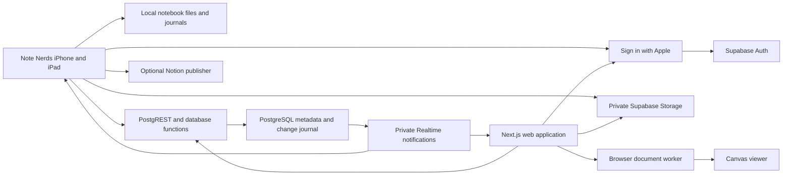

# Supabase backend and web application plan

Status: Approved direction, implementation has not started

Date: August 8, 2026

## 1. Objective

Build a private web application at `app.notenerds.com` where a Note Nerds user signs in with Apple and views the same folders, notebooks, canvases, text, handwriting, images, PDFs, layers, paper types, and planner sections that exist in the native app.

Supabase will provide authentication, PostgreSQL, private object storage, and cross-platform synchronization. The native `.notenerds` document remains the canonical file format. Local files remain authoritative while the user edits on iPhone or iPad.

The first public web release is read-only. It includes:

- Sign in with Apple.
- Folder and notebook browsing.
- Favorites, recents, Trash, tags, and search.
- A faithful canvas viewer.
- Canvas navigation, pan, zoom, fit, and planner-region paging.
- Download as `.notenerds`, PDF, or PNG when the corresponding file exists.
- Account, device, storage, privacy, and deletion settings.
- Clear sync state and recovery instructions.

Web editing follows after the read-only viewer and Supabase synchronization meet reliability, security, and performance requirements.

## 2. Decisions

These decisions define the first implementation. Revisit them only when tests or measured production use show a need.

1. The Note Nerds domain model and `.notenerds` format remain canonical.
2. Supabase stores versioned snapshots, incremental changes, metadata projections, search text, and assets.
3. PostgreSQL metadata supports fast library views. Private Storage contains large files and immutable snapshot objects.
4. Every user-owned table and private Storage bucket uses Row Level Security.
5. Normal app and web requests use the signed-in user. They do not use a Supabase secret or service-role key.
6. The first web release is read-only.
7. Browser editing waits for an explicit, versioned, cross-platform operation format.
8. Local iOS editing never waits for Supabase.
9. CloudKit stays active during a limited shadow-upload period. A device uses one remote merge provider at a time.
10. After Supabase reaches sync parity, signed-in accounts use Supabase as their remote merge provider. CloudKit becomes an optional migration source for a limited period.
11. Notion remains an optional publish and restore destination. It does not become part of web synchronization.
12. Version 1 uses Supabase encryption at rest and TLS. End-to-end encryption is a later project with separate designs for web search, previews, recovery, sharing, and key management.
13. The web viewer reads the same versioned notebook data that the native app exports. A separate web-only document model is prohibited.
14. Storage objects use immutable, content-addressed paths. A new content hash creates a new object path.
15. The browser receives short-lived signed URLs for private files.
16. Sign in with Apple is the only sign-in method for the first release. Account linking can be added later.
17. A Note Nerds account is optional for local-only native use. The web app requires an account.
18. A user may sign out without deleting local notebooks. The app explains whether unsynced local work remains.
19. Account deletion removes remote content and authentication data through a documented, tested workflow.
20. All production changes follow red, green, refactor.

## 3. Current application facts

The plan is based on the current repository and shipped identifiers.

### 3.1 Native application

- Bundle identifier: `com.strategicnerds.notenerds`
- App Store Connect Apple ID: `6799369721`
- Apple Developer team: `955GSY56UT`
- Minimum operating system: iOS and iPadOS 26
- Current document schema: version 6
- Current remote provider: private CloudKit
- Current external publisher: Notion
- Local files: library metadata, notebook snapshots, journals, and separate assets under Application Support
- Public package: `.notenerds`

### 3.2 Canonical hierarchy

```text
LibraryState
├── Folder
│   ├── FolderID
│   ├── parent FolderID
│   ├── name, dates, favorite, tags
│   └── trash date
├── Notebook
│   ├── NotebookID
│   ├── parent FolderID
│   ├── title, dates, favorite, tags
│   ├── trash date
│   ├── recognition results by canvas
│   └── Canvas[]
│       ├── CanvasID
│       ├── title and paper type
│       ├── dates
│       └── Layer[]
│           ├── LayerID
│           ├── name and visibility
│           └── CanvasObject[]
│               ├── Stroke
│               ├── RecognizedShape
│               ├── TextBlock
│               ├── ImageObject
│               └── PDFObject
└── DocumentAsset[]
    ├── AssetID
    ├── content type
    └── bytes
```

### 3.3 Existing synchronization contract

`SyncProvider` already defines:

- `start()`
- `push(_:)`
- `pull(since:)`
- `uploadAsset(_:)`
- `fetchAsset(_:)`

`DocumentChange` includes a stable change ID, notebook ID, object key, upsert or delete kind, encoded payload, client timestamp, device ID, and device sequence.

`SyncEngine` already provides a durable local queue, asset queue, pull cursor, deduplication, retries, and received-change acknowledgment. `CloudKitSyncProvider` proves the provider boundary.

### 3.4 Gaps to fix before cross-platform editing

The current change payload uses Swift `Codable` enum encoding. That format is valid for Apple clients but is too dependent on Swift compiler encoding details for long-term browser writers.

Folder changes also travel inside `DocumentChange`, which requires a notebook ID even when the subject is the library. The cross-platform protocol needs an explicit subject type and subject ID.

The backend plan therefore supports the current payload for native sync, then introduces `SyncEnvelopeV2` before web editing.

## 4. Scope

### 4.1 Backend scope

- Three isolated Supabase environments: development, staging, and production.
- Supabase Auth with Apple.
- PostgreSQL schema, constraints, indexes, functions, RLS policies, and tests.
- Private Storage buckets, object naming rules, RLS policies, retention, and tests.
- Native snapshot upload and incremental push and pull.
- Web library metadata and full-text search.
- Per-device cursors, acknowledgments, bootstrap, compaction, and tombstones.
- Account deletion and remote-data export.
- Audit events that exclude notebook content and credentials.
- CI migration checks, type generation, security tests, and deployment gates.
- Cost and quota measurements.

### 4.2 Native application scope

- Native Sign in with Apple.
- Supabase session storage and refresh.
- Optional account onboarding for existing local users.
- `SupabaseSyncProvider` behind the existing provider protocol.
- Snapshot publishing for web viewing.
- Initial library upload, remote import, and conflict review.
- Background retry that respects iOS execution limits.
- Sync status, device list, sign-out, export, and account deletion settings.
- CloudKit migration controls.

### 4.3 Web scope for the first release

- Apple sign-in and sign-out.
- Authenticated app shell.
- Sidebar with folders, My Notebooks, Favorites, Recents, and Trash.
- Notebook grid and list views.
- Search over titles, tags, typed text, recognized handwriting, and extracted PDF text.
- Read-only notebook and canvas viewer.
- Paper rendering for every current paper type.
- Layer visibility controls.
- Planner-region controls on narrow screens.
- Private asset display through short-lived signed URLs.
- Native, PDF, and PNG downloads.
- Account and device settings.
- Responsive desktop, tablet, and phone layouts.
- Keyboard and screen-reader support.

### 4.4 Later scope

- Web text editing.
- Web pen, shape, eraser, selection, layer, and canvas editing.
- Shared notebooks and public links.
- Multi-user collaboration, cursors, comments, and presence.
- Team workspaces.
- End-to-end encryption.
- Offline browser editing.
- Billing and paid storage plans.

## 5. User journeys

### 5.1 Existing native user enables web access

1. The user opens Settings, then Account and web access.
2. The user chooses Continue with Apple.
3. The app completes native Apple authorization with a nonce.
4. Supabase returns the same account that the web OAuth flow will use.
5. The app shows the number of local folders, notebooks, and bytes to upload.
6. The user chooses Upload this library.
7. Local editing remains available while the app uploads immutable assets and notebook snapshots.
8. The app publishes folder and notebook metadata after each required file succeeds.
9. The app records an initial sync checkpoint.
10. The settings screen shows Web access ready and the last successful sync time.
11. The user opens `app.notenerds.com`, signs in with Apple, and sees the library.

### 5.2 New native user already has a remote library

1. The user signs in with Apple on a new device.
2. The app fetches remote library metadata and a bootstrap manifest.
3. The app compares stable IDs and content hashes with local data.
4. Missing remote notebooks download in the background.
5. Matching hashes are skipped.
6. Differing content with the same stable ID requires Keep local, Use remote, or Import a copy.
7. The app applies folders before notebook placement.
8. The user can open downloaded notebooks while remaining files continue.

### 5.3 Web sign-in

1. The visitor selects Continue with Apple.
2. The web app starts the Supabase Apple OAuth PKCE flow.
3. Apple returns to the Supabase callback.
4. Supabase returns to `/auth/callback` on the Note Nerds web domain.
5. The callback exchanges the code and stores the session in secure cookies.
6. The user returns to the requested authenticated page.
7. A user without uploaded notebooks sees setup instructions for the native app.

### 5.4 View a notebook on the web

1. The user selects a notebook.
2. The server verifies the session and reads notebook metadata through RLS.
3. The page shows available canvases and the latest complete snapshot state.
4. The browser fetches the versioned document through a short-lived signed URL.
5. A web worker validates and parses the document.
6. The viewer renders visible paper and objects.
7. Images and PDF pages download only when their bounds approach the viewport.
8. The user can switch canvases, layers, planner regions, zoom, pan, fit, and download.

### 5.5 Delete the account

1. The user starts deletion in native settings or web settings.
2. The app requires recent authentication.
3. The confirmation lists remote notebooks, storage, and connected devices.
4. The user enters the required confirmation text.
5. A server-side deletion job marks the account pending deletion, blocks new sync writes, removes Storage objects and user rows, then removes the Auth user.
6. The system stores only a minimal deletion receipt without user content.
7. Local notebooks remain on native devices unless the user separately deletes them.

## 6. High-level architecture



### 6.1 Request boundaries

- Auth validates Apple identity and issues Supabase sessions.
- PostgreSQL stores ownership, metadata, revisions, search text, sync changes, cursors, and file references.
- Storage stores snapshot JSON, native packages, source assets, thumbnails, PDFs, and PNG exports.
- Database functions accept bounded sync batches and return bounded pull batches.
- Realtime sends invalidation notices. Durable data always comes from PostgreSQL or Storage.
- Next.js performs authenticated server rendering for library pages and sends the browser only the data needed for the selected page.
- The browser worker validates notebook data before the viewer uses it.

## 7. Environment design

Create separate Supabase projects for all three environments. Database isolation is required. A shared project with schema prefixes creates unnecessary risk.

| Environment | Supabase project | Web URL | Doppler config | Purpose |
| --- | --- | --- | --- | --- |
| Development | `notenerds-dev` | `http://localhost:3000` | `notenerds/dev` | Local work and automated integration tests |
| Staging | `notenerds-stg` | `https://stg-app.notenerds.com` | `notenerds/stg` | Device and browser acceptance tests |
| Production | `notenerds-prd` | `https://app.notenerds.com` | `notenerds/prd` | Customer data |

Choose the production database region before uploading customer data. Use the region closest to the initial customer base and the web server region. Changing the primary region later requires a planned migration.

Each environment gets:

- Its own project reference and publishable key.
- Its own database credentials.
- Its own Storage buckets.
- Its own Auth redirect allow list.
- Its own web deployment.
- Its own Apple return URL entry where required.
- Separate monitoring and retention settings.

Never copy production notebook data into development or staging.

## 8. Authentication and identity

### 8.1 Apple configuration

Use the existing native App ID `com.strategicnerds.notenerds` with Sign in with Apple enabled.

Create a web Services ID such as:

```text
com.strategicnerds.notenerds.web
```

Associate it with the existing native App ID. Configure the Supabase Auth callback URL for each environment. Configure the production web domain and return URLs in Apple Developer.

In Supabase Apple provider settings, list client IDs in this order:

1. The web Services ID.
2. The native bundle ID.

Supabase uses the first client ID for web OAuth. Native identity-token sign-in accepts the configured native audience.

Create and protect the Apple signing key used for web OAuth. Apple web OAuth client secrets expire. Automate generation from the protected `.p8` key and schedule rotation well before the six-month limit.

### 8.2 Native sign-in

Use `AuthenticationServices` for the Apple prompt.

Required flow:

1. Generate a cryptographically random raw nonce.
2. Send its SHA-256 value in the Apple request.
3. Receive the Apple identity token.
4. Send the identity token and raw nonce to Supabase Auth.
5. Verify that the returned session user matches the expected Apple provider.
6. Save Supabase refresh credentials in a device-only Keychain item.
7. Save the Apple full name when Apple supplies it on the first authorization.
8. Clear nonce state after success, cancellation, or failure.

The native app must never trust the email address as the account identifier. Apple may return a private relay address. Supabase `auth.users.id` is the internal owner ID.

### 8.3 Web sign-in

Use Supabase Apple OAuth with PKCE and secure cookie sessions.

Required routes:

- `/sign-in`
- `/auth/callback`
- `/auth/error`
- `/sign-out`

The callback accepts only allow-listed relative destinations. It rejects external redirect targets.

Cookies must be Secure in staging and production, HttpOnly where the library permits it, SameSite Lax, and scoped to the smallest useful domain.

### 8.4 Session rules

- Refresh tokens stay in Keychain on Apple devices and secure cookies on the web.
- Access tokens stay in memory when possible.
- Session refresh failures return the user to sign-in without deleting local native files.
- Sensitive actions require recent authentication.
- Sign-out revokes the local session and clears local credentials.
- Sign out all devices revokes all refresh tokens through a protected server action.
- Logs exclude tokens, Apple authorization codes, nonces, emails, names, notebook titles, and content.

### 8.5 Profile and device identity

`profiles.id` equals `auth.users.id`. `devices` uses a random installation UUID generated by the native app. A device name is optional and user-editable.

The database never uses Apple email as a foreign key.

## 9. Database model

Use declarative SQL migrations under `supabase/schemas/` and generated migration files under `supabase/migrations/`. Generate TypeScript database types after every schema change. Add a Swift DTO review whenever a database contract changes.

All user-owned tables include `owner_id uuid not null references auth.users(id) on delete cascade` unless the primary key already equals the Auth user ID.

### 9.1 `profiles`

| Column | Type | Rules |
| --- | --- | --- |
| `id` | `uuid` | Primary key, references `auth.users(id)` |
| `display_name` | `text` | Nullable, bounded length |
| `created_at` | `timestamptz` | Server default |
| `updated_at` | `timestamptz` | Server managed |
| `web_access_enabled_at` | `timestamptz` | Nullable |
| `pending_deletion_at` | `timestamptz` | Nullable |
| `storage_bytes` | `bigint` | Non-negative cached value |
| `storage_quota_bytes` | `bigint` | Positive server-assigned quota |

### 9.2 `devices`

| Column | Type | Rules |
| --- | --- | --- |
| `id` | `uuid` | Primary key, client-generated installation ID |
| `owner_id` | `uuid` | Required owner |
| `name` | `text` | Bounded user-facing name |
| `platform` | `text` | `ios`, `ipados`, or `web` |
| `app_version` | `text` | Bounded |
| `document_schema_version` | `integer` | Positive |
| `sync_protocol_version` | `integer` | Positive |
| `last_seen_at` | `timestamptz` | Server managed |
| `last_pull_sequence` | `bigint` | Non-negative |
| `revoked_at` | `timestamptz` | Nullable |

Constraints:

- Unique `(owner_id, id)`.
- A revoked device cannot push, pull, or create signed upload URLs.
- The web may create a short-lived device row per authenticated browser installation or use a session-derived ID.

### 9.3 `folders`

| Column | Type | Rules |
| --- | --- | --- |
| `id` | `uuid` | Native `FolderID` |
| `owner_id` | `uuid` | Required owner |
| `parent_id` | `uuid` | Nullable root, same owner |
| `name` | `text` | Trimmed, non-empty, bounded |
| `created_at` | `timestamptz` | Canonical client value |
| `modified_at` | `timestamptz` | Canonical client value |
| `is_favorite` | `boolean` | Required |
| `tags` | `text[]` | Bounded count and item length |
| `trashed_at` | `timestamptz` | Nullable |
| `revision` | `bigint` | Monotonic per row |
| `last_change_id` | `uuid` | Idempotence and diagnostics |

Constraints and indexes:

- Primary key `(owner_id, id)`.
- Foreign key `(owner_id, parent_id)` to `(owner_id, id)`.
- Reject `parent_id = id`.
- A database function rejects descendant cycles.
- Index `(owner_id, parent_id, trashed_at)`.
- Index `(owner_id, modified_at desc)`.

### 9.4 `notebooks`

| Column | Type | Rules |
| --- | --- | --- |
| `id` | `uuid` | Native `NotebookID` |
| `owner_id` | `uuid` | Required owner |
| `parent_folder_id` | `uuid` | Nullable root, same owner |
| `title` | `text` | Trimmed and bounded |
| `created_at` | `timestamptz` | Canonical client value |
| `modified_at` | `timestamptz` | Canonical client value |
| `last_opened_at` | `timestamptz` | Canonical client value |
| `is_favorite` | `boolean` | Required |
| `tags` | `text[]` | Bounded count and item length |
| `trashed_at` | `timestamptz` | Nullable |
| `canvas_count` | `integer` | Non-negative projection |
| `document_schema_version` | `integer` | Positive |
| `current_snapshot_id` | `uuid` | Nullable until first complete upload |
| `current_snapshot_revision` | `bigint` | Non-negative |
| `current_content_hash` | `text` | Lowercase SHA-256 or null |
| `sync_state` | `text` | `pending`, `complete`, `error`, or `deleted` |
| `revision` | `bigint` | Monotonic metadata revision |
| `last_change_id` | `uuid` | Latest accepted metadata change |

Constraints and indexes:

- Primary key `(owner_id, id)`.
- Foreign key `(owner_id, parent_folder_id)` to folders.
- Index `(owner_id, parent_folder_id, trashed_at, modified_at desc)`.
- Index `(owner_id, is_favorite, trashed_at)`.
- Index `(owner_id, last_opened_at desc)`.
- GIN index on normalized tags when tag filtering needs it.

The web lists only notebooks whose current snapshot is complete. A pending snapshot never replaces the last complete one.

### 9.5 `canvases`

This table is a web projection. The notebook snapshot remains canonical.

| Column | Type | Rules |
| --- | --- | --- |
| `id` | `uuid` | Native `CanvasID` |
| `owner_id` | `uuid` | Required owner |
| `notebook_id` | `uuid` | Same owner |
| `position` | `integer` | Zero-based, non-negative |
| `title` | `text` | Bounded |
| `paper_type` | `text` | Known versioned value |
| `layer_count` | `integer` | Positive |
| `object_count` | `integer` | Non-negative |
| `content_bounds` | `jsonb` | Validated finite rectangle or null |
| `thumbnail_path` | `text` | Private immutable object path or null |
| `thumbnail_hash` | `text` | SHA-256 or null |
| `modified_at` | `timestamptz` | Canonical value |

Constraints and indexes:

- Primary key `(owner_id, id)`.
- Foreign key `(owner_id, notebook_id)` to notebooks with cascade delete.
- Unique `(owner_id, notebook_id, position)`.
- Index `(owner_id, notebook_id, position)`.

### 9.6 `notebook_snapshots`

| Column | Type | Rules |
| --- | --- | --- |
| `id` | `uuid` | Server or client-generated snapshot ID |
| `owner_id` | `uuid` | Required owner |
| `notebook_id` | `uuid` | Same owner |
| `revision` | `bigint` | Positive notebook revision |
| `document_schema_version` | `integer` | Positive |
| `sync_protocol_version` | `integer` | Positive |
| `content_hash` | `text` | Lowercase SHA-256 |
| `document_path` | `text` | Private Storage path |
| `native_archive_path` | `text` | Optional `.notenerds` package path |
| `pdf_path` | `text` | Optional immutable PDF path |
| `document_bytes` | `bigint` | Bounded, non-negative |
| `asset_count` | `integer` | Bounded, non-negative |
| `change_high_watermark` | `bigint` | Last included server sequence |
| `created_by_device_id` | `uuid` | Required device |
| `created_at` | `timestamptz` | Server time |
| `status` | `text` | `uploading`, `complete`, `invalid`, or `superseded` |

Constraints and indexes:

- Unique `(owner_id, notebook_id, revision)`.
- Unique `(owner_id, notebook_id, content_hash)` where complete.
- Index `(owner_id, notebook_id, revision desc)`.
- A complete snapshot must reference an existing private object path owned by the same user.
- The `notebooks.current_snapshot_id` update occurs in the same database transaction that marks the snapshot complete.

### 9.7 `assets`

| Column | Type | Rules |
| --- | --- | --- |
| `id` | `uuid` | Native `AssetID` |
| `owner_id` | `uuid` | Required owner |
| `content_hash` | `text` | Lowercase SHA-256 |
| `content_type` | `text` | Allow-listed MIME type |
| `byte_size` | `bigint` | Positive and within quota |
| `storage_path` | `text` | Immutable private path |
| `created_at` | `timestamptz` | Server time |
| `verified_at` | `timestamptz` | Nullable until upload confirmation |
| `deleted_at` | `timestamptz` | Nullable |

Constraints and indexes:

- Primary key `(owner_id, id)`.
- Unique `(owner_id, content_hash)` permits per-user deduplication.
- Index `(owner_id, deleted_at)`.
- `content_type` accepts the app's supported image and PDF types.
- The native document retains the stable AssetID even when two IDs use the same stored bytes.

### 9.8 `notebook_assets`

| Column | Type | Rules |
| --- | --- | --- |
| `owner_id` | `uuid` | Required owner |
| `notebook_id` | `uuid` | Same owner |
| `asset_id` | `uuid` | Same owner |
| `snapshot_id` | `uuid` | Snapshot that references the asset |

Use a composite primary key across all four columns. Foreign keys enforce same-owner relationships.

### 9.9 `sync_changes`

| Column | Type | Rules |
| --- | --- | --- |
| `server_sequence` | `bigint generated always as identity` | Primary cursor |
| `change_id` | `uuid` | Native stable change ID |
| `owner_id` | `uuid` | Required owner |
| `subject_type` | `text` | `library`, `folder`, `notebook`, `canvas`, `layer`, `object`, or `asset` |
| `subject_id` | `uuid` | Stable subject ID |
| `notebook_id` | `uuid` | Nullable for library and folder changes |
| `object_key` | `text` | Bounded stable conflict key |
| `kind` | `text` | `upsert` or `delete` |
| `payload_version` | `integer` | Positive |
| `payload` | `bytea` | Bounded encoded change |
| `client_timestamp` | `timestamptz` | Diagnostic and conflict input |
| `device_id` | `uuid` | Same owner |
| `device_sequence` | `bigint` | Positive per device |
| `accepted_at` | `timestamptz` | Server time |

Constraints and indexes:

- Unique `(owner_id, change_id)` for idempotence.
- Unique `(owner_id, device_id, device_sequence)`.
- Index `(owner_id, server_sequence)` for pull.
- Index `(owner_id, notebook_id, server_sequence)` for notebook bootstrap.
- Index `(owner_id, subject_type, subject_id, server_sequence desc)` for compaction.
- Reject timestamps too far outside a bounded diagnostic window, while server order remains authoritative for cursors.
- Reject oversized payloads before insertion.

### 9.10 `sync_acknowledgments`

| Column | Type | Rules |
| --- | --- | --- |
| `owner_id` | `uuid` | Required owner |
| `device_id` | `uuid` | Same owner |
| `last_server_sequence` | `bigint` | Non-negative |
| `updated_at` | `timestamptz` | Server managed |

The compaction job uses active-device acknowledgments and snapshot high-watermarks. Revoked devices do not block compaction after the retention window.

### 9.11 `search_documents`

| Column | Type | Rules |
| --- | --- | --- |
| `owner_id` | `uuid` | Required owner |
| `notebook_id` | `uuid` | Same owner |
| `canvas_id` | `uuid` | Same owner |
| `title` | `text` | Notebook and canvas title projection |
| `tags_text` | `text` | Normalized tag projection |
| `typed_text` | `text` | Bounded extracted text |
| `recognized_text` | `text` | Bounded handwriting text |
| `pdf_text` | `text` | Bounded extracted PDF text |
| `search_vector` | `tsvector` | Generated or trigger-maintained |
| `updated_at` | `timestamptz` | Server managed |

Use primary key `(owner_id, canvas_id)`, a GIN index on `search_vector`, and a trigram index for title substring search if measured use requires it.

### 9.12 `deletion_tombstones`

Store opaque stable IDs and deletion times after content deletion so an offline device cannot recreate permanently deleted data during the retention window.

Columns:

- Owner ID.
- Subject type.
- Subject ID.
- Deletion change ID.
- Server sequence.
- Deleted at.
- Expires at.

No notebook title, text, asset path, or other content belongs in this table.

### 9.13 `account_deletion_jobs`

Store job state, attempt count, next retry time, timestamps, and a bounded error code. Do not store content or credentials.

### 9.14 Optional later tables

- `share_links`
- `workspace_members`
- `notebook_permissions`
- `billing_accounts`
- `usage_events`

Do not create them during the private viewer release.

## 10. Database functions and API contracts

Prefer PostgreSQL functions called through PostgREST for atomic sync actions. Functions run with the authenticated user and preserve RLS. Use `security invoker` unless a narrowly reviewed operation requires `security definer`; every definer function sets an empty search path and qualifies all objects.

### 10.1 `push_sync_changes`

Input:

```json
{
  "device_id": "uuid",
  "changes": [
    {
      "change_id": "uuid",
      "subject_type": "object",
      "subject_id": "uuid",
      "notebook_id": "uuid",
      "object_key": "stroke:uuid",
      "kind": "upsert",
      "payload_version": 1,
      "payload_base64": "...",
      "client_timestamp": "ISO-8601",
      "device_sequence": 42
    }
  ]
}
```

Rules:

- Require an authenticated user.
- Require an active device owned by that user.
- Limit each request to 200 changes.
- Limit decoded bytes per change and per batch.
- Validate UUIDs, enums, sequence values, and timestamps.
- Insert idempotently by owner and change ID.
- Return the server sequence assigned to every accepted or previously accepted change.
- Apply metadata projections in the same transaction when the payload type permits it.
- Reject the entire batch if any new change is invalid.

Output:

```json
{
  "accepted": [
    { "change_id": "uuid", "server_sequence": 1234 }
  ],
  "server_time": "ISO-8601"
}
```

### 10.2 `pull_sync_changes`

Input:

- Device ID.
- Cursor, default zero.
- Limit, maximum 500.

Output:

- Changes owned by the authenticated user with server sequence greater than the cursor.
- Ascending server sequence.
- `next_cursor` equal to the final returned sequence or the input cursor.
- `has_more`.
- Minimum available cursor after compaction.
- A `bootstrap_required` flag if the requested cursor predates retained history.

The client repeats while `has_more` is true and commits the cursor only after applying and saving the batch.

### 10.3 `begin_snapshot_upload`

Input:

- Device ID.
- Notebook ID.
- Proposed revision.
- Document schema version.
- Content hash.
- Byte count.
- Asset descriptors.
- Included change high-watermark.

Output:

- Snapshot ID.
- Immutable object paths.
- Existing asset hashes that need no upload.
- Upload authorization data where needed.

Rules:

- Check notebook ownership.
- Enforce account quota and object limits.
- Reuse an existing complete snapshot with the same content hash.
- Never change the current snapshot during this step.

### 10.4 `complete_snapshot_upload`

Input:

- Snapshot ID.
- Uploaded object metadata.
- Canvas projection rows.
- Search projection rows.
- Notebook-asset links.

Rules:

- Verify ownership and expected object paths.
- Verify every required asset row is complete.
- Validate counts, bounds, paper types, text lengths, and hashes.
- Mark the snapshot complete.
- Replace canvas and search projections for that notebook.
- Update `notebooks.current_snapshot_id` and content hash in the same transaction.
- Send a private invalidation event after commit.

### 10.5 `bootstrap_library`

Return a bounded manifest containing:

- User profile and quota summary.
- Active device state.
- All folder metadata.
- Notebook metadata and current complete snapshot references.
- Tombstones still within retention.
- Current maximum server sequence.

Large accounts use keyset pagination. Never return asset bytes inside this response.

### 10.6 `acknowledge_sync_cursor`

Advance the current device acknowledgment. The function rejects cursor regression and sequences beyond the user's accepted maximum.

### 10.7 `search_library`

Input:

- Query string.
- Optional folder, tags, Trash, and favorite filters.
- Keyset cursor.
- Bounded result count.

Output:

- Notebook and canvas IDs.
- Safe text snippets with result type.
- Ranking score.
- Modified date and folder path.

The query must run under RLS and use parameterized SQL.

### 10.8 `request_account_deletion`

Require recent authentication. Mark the profile pending deletion, revoke device writes, create a deletion job, and return a request ID.

## 11. Row Level Security

RLS is mandatory on every table in an exposed schema. Deny access by default.

### 11.1 Base rule

For direct user-owned rows:

```sql
using ((select auth.uid()) = owner_id)
with check ((select auth.uid()) = owner_id)
```

Use separate select, insert, update, and delete policies when their rules differ. Do not rely on one broad policy when a smaller permission set is available.

### 11.2 Relationship checks

- A notebook may reference only a folder owned by the same user.
- A canvas may reference only a notebook owned by the same user.
- A snapshot may reference only a notebook and device owned by the same user.
- An asset link may join only rows owned by the same user.
- A device may update only its own last-seen and acknowledgment fields through reviewed functions.

Use composite foreign keys where possible. RLS remains a second control.

### 11.3 RLS test matrix

For every table and function, test:

- The owner can perform allowed actions.
- Another authenticated user sees zero rows and cannot change them.
- An anonymous user sees zero rows.
- A revoked device cannot call sync functions.
- A malicious foreign parent ID fails.
- A guessed Storage path fails.
- A user cannot raise their quota or storage counter.
- A user cannot mark an uploading snapshot complete through a raw table update.
- A user cannot update server-managed sequence or audit fields.

Use two authenticated test users in every RLS integration suite.

## 12. Storage design

All notebook buckets are private.

### 12.1 Buckets

| Bucket | Contents | Typical access |
| --- | --- | --- |
| `notebook-documents` | Deterministic document JSON and `.notenerds` archives | Native upload, native and web read |
| `notebook-assets` | Source images and PDFs | Native upload, native and web read |
| `canvas-previews` | PNG or WebP canvas thumbnails | Native upload, web read |
| `notebook-exports` | Optional generated PDF and PNG files | Native upload or later worker generation |

### 12.2 Object paths

Use owner-prefixed, immutable paths:

```text
<owner-id>/<notebook-id>/documents/<revision>/<sha256>.json
<owner-id>/<notebook-id>/archives/<revision>/<sha256>.notenerds
<owner-id>/assets/<sha256-prefix>/<sha256>
<owner-id>/<notebook-id>/previews/<snapshot-id>/<canvas-id>-<sha256>.webp
<owner-id>/<notebook-id>/exports/<snapshot-id>/<sha256>.pdf
```

Do not overwrite an existing content path. New bytes receive a new hash and path. This prevents stale CDN responses and makes retries idempotent.

### 12.3 Upload rules

- Small JSON and thumbnail files may use standard uploads.
- Files larger than 6 MB use resumable TUS uploads.
- The client records upload state durably and resumes after interruption.
- The upload request declares the expected content type and size.
- The database checks quota before authorizing an upload.
- Completion confirms object metadata before publishing the snapshot.
- Parallel part count is bounded.
- The native app streams files from disk.

### 12.4 Download rules

- Private web downloads use short-lived signed URLs.
- Signed URL lifetime defaults to five minutes.
- Browser code refreshes an expired URL through an authenticated server action.
- Asset fetches remain lazy and viewport-aware.
- Responses set safe content types and attachment names.
- The web app never inserts untrusted SVG or HTML from notebook assets.

### 12.5 Storage cleanup

A scheduled job removes:

- Uploading snapshots that expired before completion.
- Superseded snapshots beyond retention.
- Unreferenced assets after a grace period.
- Expired exports.
- All objects for completed account deletion jobs.

Every cleanup query uses owner and reference checks. Test it against shared per-user content hashes and interrupted uploads.

## 13. Synchronization design

### 13.1 Local-first rule

Every native edit follows this order:

1. Apply the domain operation locally.
2. Append the local journal.
3. Update visible app state.
4. Enqueue the remote change.
5. Return control to the user.
6. Push when network and execution time permit.

Network failure never blocks drawing, text, opening, search, or undo.

### 13.2 Push

- Push assets before changes that require those assets.
- Send changes in batches of at most 200 and within a byte limit.
- Treat repeated change IDs as success.
- Keep changes in the local durable queue until the backend returns their server sequences.
- Retry network loss and transient server failures with bounded exponential backoff and jitter.
- Honor server retry instructions.
- Stop automatic retry for authentication, quota, schema, and permission failures until user action resolves them.

### 13.3 Pull

- Pull by server sequence.
- Apply batches in ascending server order.
- Deduplicate by change ID.
- Save notebook and library state before advancing the local cursor.
- Fetch required assets before making dependent objects available.
- If the cursor predates retained changes, start bootstrap from the newest complete snapshots.

### 13.4 Conflict rules

Keep the current deterministic rule for native protocol version 1:

1. Newer client timestamp.
2. Lexicographically greater device ID when timestamps match.
3. Greater device sequence when device IDs match.

Server sequence orders delivery. It does not replace the documented conflict rule.

Before web editing, define operation-specific conflict behavior in `SyncEnvelopeV2`, especially for:

- Canvas order.
- Layer order.
- Folder moves.
- Notebook moves.
- Rename collisions.
- Text edits.
- Object transforms.
- Deletes followed by edits.

### 13.5 Snapshots

Create a deterministic snapshot:

- After initial account upload.
- After a short idle period following document changes.
- When closing a notebook.
- Before the app enters the background when time permits.
- After a configured number or byte size of incremental changes.
- Before change-history compaction.

The web viewer uses the latest complete snapshot. During active native editing, the web may trail until the next complete snapshot. Initial target: 95 percent of completed native edits appear on the web within 10 seconds when the app has connectivity.

### 13.6 Compaction

Retain incremental changes until:

- A complete snapshot includes them.
- Every active device has acknowledged a later sequence, or the device has passed the inactive-device retention period.
- The minimum retention period has elapsed.
- Required deletion tombstones have been copied to their retention table.

Compaction runs in bounded batches. It records counts and durations without content.

### 13.7 Realtime

Use private Realtime Broadcast for small invalidation events such as:

```json
{
  "type": "snapshot-complete",
  "notebook_id": "uuid",
  "revision": 17
}
```

Realtime is an optimization. Clients recover through normal pull and snapshot queries after missed messages. Do not send full notebook content through Realtime.

### 13.8 CloudKit transition

#### Phase A: Shadow snapshot upload

- CloudKit remains the active remote merge provider.
- Supabase receives full snapshots and metadata for web viewing.
- Supabase changes do not apply back to native devices.
- Compare CloudKit and Supabase hashes in diagnostics.

#### Phase B: Supabase sync beta

- Internal and staging accounts choose one active provider.
- A provider-choice record is stored locally and remotely.
- Import CloudKit state into Supabase once.
- Disable CloudKit push and pull before enabling Supabase merge.
- Keep a local rollback snapshot.

#### Phase C: Supabase default for signed-in users

- New signed-in users use Supabase.
- Existing users receive a guided migration.
- Local-only users may continue without an account.
- CloudKit code stays available during a fixed rollback window.

#### Phase D: Retirement decision

- Measure migration success, support volume, data parity, and recovery results.
- Remove or retain CloudKit only after an explicit product decision.

At no phase may a device apply remote changes from CloudKit and Supabase into the same local library concurrently.

## 14. Cross-platform document contract

### 14.1 Snapshot format

The web parser must support current native document schema version 6 and legacy versions 4 and 5 before launch.

Add:

- A checked-in JSON Schema for every supported document version.
- Swift-generated golden fixtures containing every paper, object, layer, asset reference, recognition result, and planner type.
- TypeScript parser tests against those fixtures.
- Swift decoder tests against fixtures written by TypeScript where applicable.
- Migration fixtures from every supported older schema.
- Invalid fixtures for unknown object cases, non-finite numbers, oversized arrays, malformed UUIDs, and path attacks.

The parser returns a typed result or a structured error. It never passes unknown JSON directly to rendering code.

### 14.2 `SyncEnvelopeV2`

Define an explicit JSON wire format before browser editing:

```json
{
  "protocol_version": 2,
  "change_id": "uuid",
  "subject": {
    "type": "object",
    "id": "uuid",
    "notebook_id": "uuid"
  },
  "object_key": "object:uuid",
  "action": "replace_text",
  "body": {},
  "client_timestamp_ms": 1786220000000,
  "device_id": "uuid",
  "device_sequence": 42
}
```

Requirements:

- Explicit discriminator strings.
- Explicit field names.
- Millisecond timestamps.
- Stable UUID string form.
- Bounded arrays, text, samples, and payload bytes.
- Unknown action rejection.
- Protocol-version negotiation.
- Golden Swift and TypeScript fixtures.
- Deterministic encoding for hashes and diagnostics.

Native protocol version 1 remains readable during migration. New browser writes require version 2.

## 15. Native application work

### 15.1 New modules

Suggested structure:

```text
NoteNerds/
├── Account/
│   ├── AppleAccountAuthorizer.swift
│   ├── SupabaseSession.swift
│   ├── SupabaseSessionStore.swift
│   ├── AccountService.swift
│   └── AccountSettingsView.swift
├── Supabase/
│   ├── API/
│   │   ├── SupabaseClient.swift
│   │   ├── SupabaseDatabaseAPI.swift
│   │   └── SupabaseStorageAPI.swift
│   ├── Sync/
│   │   ├── SupabaseSyncProvider.swift
│   │   ├── SupabaseSnapshotPublisher.swift
│   │   ├── SupabaseBootstrapper.swift
│   │   └── SupabaseMigrationCoordinator.swift
│   └── Models/
│       ├── SupabaseDTOs.swift
│       └── SyncEnvelopeV2.swift
```

Keep Supabase DTOs out of `Domain`. Map at the infrastructure boundary.

### 15.2 Client dependency decision

Use the official Supabase Swift client for Auth session handling, PostgREST, Storage, and Realtime unless a short prototype proves that its behavior conflicts with the current provider contract.

The repository currently rejects every third-party runtime package. Replace that blanket check with an allow list containing the exact official package URL and pinned version. Add license, vulnerability, update, and transitive-package checks.

Keep `SupabaseSyncProvider` behind Note Nerds protocols so the dependency cannot enter the domain model.

### 15.3 Native settings

Add Account and web access settings with:

- Sign in with Apple.
- Current account.
- Last successful upload and pull.
- Pending change and upload counts.
- Storage used and quota.
- Connected devices.
- Revoke device.
- Sync now.
- Export remote data.
- Sign out.
- Delete account.
- CloudKit migration state while migration exists.

### 15.4 Background behavior

- Use foreground time first.
- Request background processing for queued uploads where iOS permits it.
- Save upload checkpoints before suspension.
- Cancel cleanly when protected data becomes unavailable.
- Resume after app activation, reachability change, or background task grant.
- Never promise immediate background completion.

## 16. Web application architecture

### 16.1 Technology

- Latest supported Next.js App Router release, pinned in the lockfile.
- React and TypeScript strict mode.
- Supabase JavaScript client.
- Supabase SSR cookie adapter isolated in one module. The official SSR package API may change.
- Tailwind CSS for tokens and layout.
- Accessible primitives for menus, dialogs, tooltips, and focus management.
- Zod or an equivalent typed schema validator for boundary data.
- Vitest and React Testing Library for behavior tests.
- Playwright for browser workflows.
- Native Canvas 2D plus DOM overlays for the initial notebook viewer.
- A web worker for document validation, spatial indexing, and render preparation.

Avoid a large drawing framework in the read-only release. Add WebGL or a scene library only after profiling proves Canvas 2D misses the performance targets.

### 16.2 Repository structure

```text
web/
├── src/
│   ├── app/
│   │   ├── (auth)/
│   │   │   ├── sign-in/
│   │   │   └── auth/callback/
│   │   ├── (app)/
│   │   │   ├── layout.tsx
│   │   │   ├── notebooks/
│   │   │   ├── folders/[folderId]/
│   │   │   ├── favorites/
│   │   │   ├── recents/
│   │   │   ├── trash/
│   │   │   ├── search/
│   │   │   ├── settings/
│   │   │   └── notebook/[notebookId]/
│   │   ├── error.tsx
│   │   ├── not-found.tsx
│   │   └── layout.tsx
│   ├── features/
│   │   ├── auth/
│   │   ├── library/
│   │   ├── search/
│   │   ├── notebook-viewer/
│   │   ├── downloads/
│   │   └── account/
│   ├── lib/
│   │   ├── supabase/
│   │   ├── document-format/
│   │   ├── security/
│   │   └── observability/
│   ├── workers/
│   │   └── document.worker.ts
│   └── styles/
├── tests/
│   ├── fixtures/
│   ├── integration/
│   └── e2e/
├── public/
├── next.config.ts
├── tsconfig.json
└── package.json

supabase/
├── config.toml
├── schemas/
├── migrations/
├── seed.sql
├── tests/
└── functions/
```

Keep feature code together. Do not place all database calls in one general helper.

### 16.3 Server and client responsibilities

Server components and route handlers:

- Validate sessions.
- Query metadata through RLS.
- Create short-lived signed URLs.
- Render initial library and notebook shells.
- Enforce safe redirects.
- Perform recent-auth checks for sensitive settings.
- Add security headers.

Client components:

- Interactive search field.
- Sidebar collapse state.
- Grid and list preferences.
- Canvas pan, zoom, planner paging, and layer controls.
- Download progress.
- Realtime invalidation subscription.

Web worker:

- Parse and validate document JSON.
- Migrate supported older schema versions in memory.
- Build a spatial index.
- Produce visible render commands.
- Calculate content bounds.
- Report structured parse errors.

### 16.4 Routes

| Route | Purpose |
| --- | --- |
| `/sign-in` | Apple sign-in |
| `/auth/callback` | PKCE code exchange |
| `/notebooks` | Root notebook library |
| `/folders/[folderId]` | Folder contents |
| `/favorites` | Favorite folders and notebooks |
| `/recents` | Recently opened notebooks |
| `/trash` | Trashed folders and notebooks |
| `/search?q=` | Search results |
| `/notebook/[notebookId]` | Notebook viewer |
| `/notebook/[notebookId]/canvas/[canvasId]` | Direct canvas link |
| `/settings/account` | Account and deletion |
| `/settings/devices` | Device list and revocation |
| `/settings/storage` | Usage and quota |
| `/setup` | Native upload instructions for an empty remote account |

### 16.5 Library design

- Desktop uses a collapsible left sidebar and a notebook detail area.
- Narrow screens use a standard navigation drawer.
- Folders remain in the navigation area.
- The detail area contains notebooks only.
- Search begins as an icon, expands into a field, and collapses on outside interaction when empty.
- Folder title replaces My Notebooks inside a folder.
- Trash notebooks use the same dashed preview treatment as the native app.
- Empty, loading, offline, stale, and error states have plain instructions.
- The interface uses system fonts and standard symbols where the browser platform provides a safe equivalent.

### 16.6 Notebook viewer

The viewer must support:

- Every object type supported by native schema versions 4, 5, and 6.
- Every current paper type, including both planner papers and hexagons.
- Layer order and visibility.
- Stroke pressure, width, opacity, cap, and instrument approximations.
- Shapes and arrowheads.
- Text frames, alignment, font size, and font fallback.
- Images and PDF pages.
- Infinite canvas coordinates.
- Fit to content and return home.
- Canvas chooser.
- Planner region paging on narrow screens.
- Keyboard zoom and pan.
- Reduce Motion.

Rendering order:

1. Paper background.
2. Visible layers from back to front.
3. Objects in stored order.
4. Viewer-only focus and accessibility overlays.

Use a tile cache keyed by snapshot, canvas, zoom bucket, tile coordinate, and visible-layer set. Invalidate the cache when the snapshot or layer state changes.

### 16.7 Font behavior

Native notebooks may reference iOS system fonts that a browser lacks.

Rules:

- Use the stored PostScript name when a licensed web font is available.
- Map Apple system fonts to the browser system stack.
- Use a documented fallback table.
- Preserve frame, size, and alignment.
- Show a small viewer notice only when fallback materially changes text bounds.
- Never upload or distribute Apple font files.

### 16.8 PDF behavior

- Render PDF pages with a maintained browser PDF library in a worker.
- Fetch only referenced files and visible pages.
- Bound page count, dimensions, decoded memory, and concurrent renders.
- Treat embedded PDF text as search data, never as HTML.
- Provide a download action for the original asset when allowed.

### 16.9 Accessibility

Canvas graphics need a parallel document outline.

Provide:

- Notebook and canvas headings.
- Layer list with visibility state.
- Typed text in document order.
- Recognized handwriting text identified as recognition output.
- Image and PDF labels when metadata exists.
- Keyboard controls for canvas changes, zoom, pan, fit, and layer visibility.
- Visible focus.
- Sufficient contrast.
- Reduced animation.
- Screen-reader announcements for snapshot refresh and errors.

The graphic viewer itself has a concise label and instructions. Users can switch to the outline without losing the selected canvas.

## 17. Search

### 17.1 Indexed content

- Folder names.
- Notebook titles.
- Canvas titles.
- Tags.
- Typed text.
- Recognized handwriting.
- Extracted PDF text.

### 17.2 Search behavior

- Prefix and full-term title matches rank above body text.
- Current-folder filtering is optional and visible.
- Trash is excluded unless the user searches Trash.
- Results identify notebook, canvas, match type, folder path, and modified date.
- Selecting a result opens the correct canvas.
- Text snippets escape all markup.

### 17.3 Search update

The native snapshot publisher sends a bounded search projection produced from the canonical notebook. The completion function swaps projections in the same transaction that publishes the snapshot.

Future server-side extraction must use a sandboxed bounded worker. The first release uses the native app's existing recognition and PDF extraction.

## 18. Security plan

### 18.1 Threats

- Cross-user row access caused by missing or weak RLS.
- Cross-user Storage access caused by guessable paths or broad policies.
- Stolen refresh tokens.
- Apple OAuth redirect manipulation.
- Replay of native change batches.
- Oversized JSON, archive, image, or PDF input.
- Path traversal in native packages.
- Stored script injection through titles, tags, extracted text, or filenames.
- Unsafe PDF or image decoding.
- Quota abuse and storage exhaustion.
- Device spoofing.
- Malicious client timestamps and sequences.
- Secret exposure in source, logs, browser bundles, CI artifacts, or build settings.
- Accidental production data use in tests.
- Incomplete account deletion.

### 18.2 Controls

- RLS and same-owner foreign keys on all user data.
- Private buckets and owner-prefixed object policies.
- Publishable keys in clients. Secret keys remain server-only.
- Native Apple nonce and web PKCE.
- Secure Keychain and cookie session storage.
- Bounded database functions.
- Idempotent change IDs and monotonic device sequences.
- Immutable content-addressed Storage paths.
- JSON schema validation before rendering.
- Plain-text rendering for user strings.
- Strict Content Security Policy.
- `frame-ancestors 'none'` unless a later sharing product requires embedding.
- `X-Content-Type-Options: nosniff`.
- Strict referrer and permissions policies.
- Rate limits by user, device, IP class, and operation.
- File content-type and signature checks.
- PDF processing in a worker with memory and time bounds.
- Database statement timeouts on search and sync functions.
- Secret scanning on every commit and Git history checks before release.
- Dependency audit and lockfile review.
- Structured error codes without content.
- Account deletion integration tests.

### 18.3 Secret inventory

Client-safe:

- Supabase project URL.
- Supabase publishable key.
- Apple Services ID.
- Native Apple bundle ID.

Protected:

- Supabase secret key, only if a server maintenance function needs it.
- Database connection strings.
- Apple `.p8` signing key.
- Generated Apple web OAuth client secret.
- Vercel deployment token if CI uses one.
- Doppler service tokens.

Store protected values in Doppler and the target deployment secret store. Never write them to `.env` files committed to Git.

### 18.4 Security release checks

- RLS negative tests pass for every table and bucket.
- Anonymous requests return no private rows or files.
- Cross-user ID substitution tests fail.
- OAuth redirect and nonce tests pass.
- Dependency audit has no unresolved high-severity issue.
- Secret scan passes for the current tree and history.
- Content Security Policy report has no unexplained violation.
- Archive, JSON, PDF, and image fuzz cases fail safely.
- Account deletion removes rows and objects in staging.
- Logs contain no test marker placed in notebook content.

## 19. Privacy and data rights

Before production:

- Update the privacy policy for Supabase processing and web access.
- Update App Store privacy answers for account identifiers and user content.
- State where remote notebook data is stored.
- Explain that web access requires uploading notebook data to Supabase.
- Provide remote data export.
- Provide account deletion from native and web settings.
- Provide device revocation.
- Document retention for Trash, snapshots, logs, backups, tombstones, and deletion receipts.
- Complete a data-processing agreement review.
- List subprocessors on the public privacy page.
- Define a process for access and deletion requests.

Do not use notebook content for advertising, model training, or product analytics.

## 20. Performance targets

### 20.1 Native sync

- Local edit response has zero network dependency.
- Sync queue restore: under 100 ms for 10,000 pending records on the reference device.
- Push batch preparation: under 20 ms of main-thread work.
- Snapshot encoding and hashing run off the main actor.
- Unchanged notebook upload: zero file transfer.
- Interrupted large upload resumes without restarting completed chunks when the upload session remains valid.
- Initial library metadata appears before large assets finish downloading.

### 20.2 Backend

- Library query p95 under 150 ms at the database for 5,000 notebooks owned by one user.
- Search p95 under 300 ms for 100,000 indexed canvas rows owned by one user.
- Pull batch p95 under 250 ms for 500 changes excluding client network time.
- Push batch p95 under 400 ms for 200 small changes.
- Snapshot completion p95 under 500 ms excluding file upload.
- Every list uses keyset pagination.
- Every query used by a release path has an `EXPLAIN ANALYZE` review with representative data.

### 20.3 Web

- Authenticated library first content under 1.5 seconds p75 on a warm server and broadband connection.
- Route JavaScript kept below an agreed budget, with the PDF viewer split into a lazy chunk.
- Notebook shell becomes interactive before the full document downloads.
- Canvas first render under 500 ms after validated document data is available for a representative notebook.
- Pan and zoom target 60 frames per second on a current desktop and 30 or better on the minimum supported mobile browser.
- Main-thread tasks stay below 50 ms during normal viewer interaction.
- Images, PDFs, and distant tiles load lazily.
- A single canvas cannot allocate unbounded bitmap memory.

### 20.4 Capacity assumptions

Start planning with these assumptions and replace them with measured staging data:

- 10,000 monthly active users in the first major growth stage.
- 100 notebooks per active user.
- 20 canvases per notebook.
- 250 MB median remote storage per active user.
- 2.5 TB median aggregate user storage at that stage.
- 2,500 daily active users.
- 200 accepted sync changes per active user per day.
- 500,000 accepted changes per day before compaction.

Create cost alerts at 50, 75, 90, and 100 percent of the monthly budget. Measure database size, change growth, Storage bytes, egress, Auth users, function calls, Realtime connections, and web bandwidth.

## 21. Reliability and recovery

### 21.1 Failure handling

| Failure | Expected behavior |
| --- | --- |
| No network | Native editing continues; web shows cached shell or offline page |
| Expired session | Refresh once, then require sign-in |
| Quota exceeded | Stop new uploads, preserve local queue, show exact action |
| Upload interrupted | Resume or restart the immutable upload safely |
| Snapshot completion fails | Previous complete snapshot stays current |
| Invalid remote snapshot | Quarantine it and retain the prior complete snapshot |
| Pull cursor expired | Bootstrap from complete snapshots and tombstones |
| Device revoked | Stop push and pull, preserve local files, require sign-in |
| Database unavailable | Retry with jitter; local work continues |
| Storage unavailable | Retry files; do not publish incomplete metadata |
| Web renderer error | Show canvas-level error and retain library navigation |

### 21.2 Backups

- Enable production database backups and point-in-time recovery appropriate to the plan tier.
- Document Storage durability and recovery limits.
- Run quarterly restore drills into an isolated project.
- Verify RLS after every restore.
- Keep native package export available as a user-controlled backup.
- Record recovery time and recovery point objectives before launch.

Suggested initial objectives:

- Database recovery point: 15 minutes or better.
- Database recovery time: 4 hours or better.
- User-visible sync service recovery: 8 hours or better.

These are operating targets, not promises to customers until the system has measured results.

## 22. Observability

Collect metadata only:

- Auth success and failure code.
- Push and pull counts, bytes, duration, retry count, and error code.
- Snapshot count, bytes, duration, and state.
- Storage quota and aggregate bytes.
- Database function latency and failure rate.
- Web route latency and status.
- Viewer parse version, duration, object count, and failure code.
- Background job state.
- Account deletion state.

Exclude:

- Titles.
- Folder names.
- Tags.
- Text and handwriting.
- Asset filenames supplied by users.
- Raw document payloads.
- Signed URLs.
- Tokens, codes, nonces, cookies, and authorization headers.

Create alerts for:

- Auth callback failure rate.
- RLS or permission errors above baseline.
- Push and pull failure rate.
- Snapshot completion backlog.
- Storage nearing quota.
- Database CPU, connections, disk, and replication delay.
- Web error rate and slow route rate.
- Deletion jobs beyond their deadline.
- Apple client-secret rotation window.

## 23. Test-driven development plan

Every checklist item that changes production behavior starts with a failing test through a public boundary.

### 23.1 Contract tests

- Swift writes every supported schema fixture; TypeScript reads it.
- TypeScript validates and re-encodes supported neutral fixtures; Swift reads them.
- Every paper type and object type appears in fixtures.
- Millisecond dates, UUID case, optional fields, and sorted encoding remain stable.
- Newer unknown schemas fail without changing data.
- Older supported schemas migrate deterministically.
- `SyncEnvelopeV2` golden fixtures match byte for byte where deterministic encoding is required.

### 23.2 Database behavior tests

- Folder hierarchy, cycles, moves, Trash, restore, and permanent deletion.
- Notebook metadata, folder placement, sorting, and snapshot publication.
- Snapshot state transition from uploading to complete.
- Incomplete snapshot cannot replace the current complete snapshot.
- Change insertion is idempotent.
- Device sequences reject duplicates and regressions.
- Pull pagination and cursor handling.
- Bootstrap after compaction.
- Tombstone retention.
- Asset deduplication within one owner.
- Quota checks under concurrent uploads.
- Search ranking and filters.
- Account deletion state and retries.

### 23.3 RLS tests

- Owner, other user, anonymous, revoked device, and pending-deletion user cases for every table.
- Storage read, insert, update, list, and delete cases for every bucket.
- Foreign owner IDs fail.
- Raw table updates cannot publish snapshots or change quota.
- Realtime private channel authorization fails for another user.

### 23.4 Swift behavior tests

- Apple nonce creation and token handoff.
- Keychain save, refresh rotation, sign-out, and corruption recovery.
- Initial upload planning and progress.
- Supabase error mapping.
- Durable change and upload retry.
- Push batching and idempotence.
- Pull pagination, apply, save, then cursor advance.
- Snapshot hashing, unchanged skip, and asset reuse.
- CloudKit-to-Supabase provider switch.
- Two-provider concurrency prevention.
- Sign-out with unsynced local work.
- Account deletion request.

### 23.5 Swift integration tests

Run against local Supabase:

- Native Apple auth substitute using a test identity path unavailable in production.
- Create folders and notebooks, upload snapshots and assets, pull on a second device, and compare canonical hashes.
- Offline edits followed by reconnect.
- Conflicting edits from two devices.
- Interrupted upload.
- Expired cursor bootstrap.
- Revoked device.
- Quota failure.
- Permanent deletion and stale-device replay.

### 23.6 Web behavior tests

- Sign-in redirect and safe callback destination.
- Signed-out route protection.
- Library folder navigation.
- Search expand, collapse, query, filter, and empty state.
- Notebook grid and list state.
- Trash styling.
- Viewer canvas selection, layer visibility, pan, zoom, fit, and planner paging.
- Unsupported schema and damaged document state.
- Expired signed URL refresh.
- Account, devices, storage, sign-out, and deletion flows.
- Screen-reader outline and keyboard controls.

### 23.7 Browser end-to-end tests

Use local Supabase and seeded users:

1. Sign in.
2. Browse root and nested folders.
3. Search typed text and recognized handwriting.
4. Open a notebook containing every paper and object type.
5. Switch layers and canvases.
6. Open daily and weekly planner regions on a narrow viewport.
7. Download a native file.
8. Revoke a device.
9. Sign out.

Run Chromium, WebKit, and Firefox for the main viewer flow. Run mobile Safari-sized WebKit coverage for narrow layouts.

### 23.8 Security tests

- Cross-user database and Storage access.
- Redirect attacks.
- Token and nonce replay.
- Oversized sync batches and payloads.
- Malformed base64.
- Archive traversal and duplicate paths.
- Billion-laughs-style JSON depth and collection bounds.
- Script strings in every user text field.
- Malformed image and PDF inputs.
- Signed URL expiration.
- Rate limit enforcement.
- Log redaction marker test.

### 23.9 Performance tests

- 5,000-notebook library query.
- 100,000-canvas search index.
- 10,000 pending local changes.
- 500-change pull page.
- 200-change push batch.
- 1 GB resumable asset upload in a controlled test environment.
- Notebook with 100,000 stroke samples.
- Canvas with 10,000 objects across 50 layers.
- 500-page PDF reference.
- Web memory stability during 30 minutes of pan, zoom, and canvas switching.

## 24. CI and deployment

### 24.1 Pull request checks

Keep the existing iOS checks and add parallel jobs.

Backend job:

- Install the pinned Supabase CLI.
- Start local Supabase.
- Apply the declarative schema from empty state.
- Run database behavior and RLS tests.
- Generate database types.
- Fail if generated types differ.
- Run migration lint and destructive-change review.
- Stop local services.

Web job:

- Install dependencies with the committed lockfile.
- Run formatting check.
- Run ESLint.
- Run TypeScript strict checking.
- Run behavior tests and coverage.
- Build the production Next.js application.
- Run Playwright against local Supabase.
- Run dependency and license checks.
- Scan the built browser assets for protected secret names and test marker values.

Security job:

- Secret scan.
- Dependency audit.
- SQL policy coverage check.
- Static analysis.
- Container and workflow permission review when related files change.

### 24.2 Staging deployment

On merge to `main`:

1. Apply reviewed migrations to staging.
2. Deploy server functions if any.
3. Deploy the web app to staging.
4. Run staging smoke tests.
5. Run an authenticated native-to-web snapshot test with a dedicated test account.
6. Report deployment and migration identifiers.

### 24.3 Production deployment

Use a protected manual approval:

1. Confirm staging has the same migration set.
2. Confirm backup health.
3. Apply backward-compatible database migrations.
4. Deploy backend functions.
5. Deploy web code that can use old and new schema during the rollout.
6. Run private smoke tests.
7. Release the matching native build after backend compatibility is confirmed.
8. Remove old compatibility paths only in a later release.

Every migration needs a rollback or forward-fix plan. Large data changes run in bounded background batches after the schema change.

### 24.4 Vercel

Recommended web deployment:

- Vercel preview deployments for pull requests.
- Staging domain for `main`.
- Production domain after approval.
- Server region aligned with the Supabase database region.
- Protected environment variables from Doppler or Vercel's secret store.
- Preview deployments connected only to development or isolated preview data.

Never connect an untrusted pull request preview to production Supabase.

## 25. Doppler variables

Add these names to `notenerds/dev`, `notenerds/stg`, and `notenerds/prd` with environment-specific values.

Client-safe configuration:

- `SUPABASE_URL`
- `SUPABASE_PUBLISHABLE_KEY`
- `NEXT_PUBLIC_SUPABASE_URL`
- `NEXT_PUBLIC_SUPABASE_PUBLISHABLE_KEY`
- `APPLE_WEB_SERVICES_ID`
- `NOTE_NERDS_WEB_URL`

Protected configuration:

- `SUPABASE_SECRET_KEY`, only when a reviewed server task needs it
- `SUPABASE_DB_URL`
- `SUPABASE_ACCESS_TOKEN` for deployment automation
- `APPLE_SIGN_IN_KEY_ID`
- `APPLE_SIGN_IN_PRIVATE_KEY`
- `APPLE_SIGN_IN_CLIENT_SECRET`
- `VERCEL_TOKEN`
- `VERCEL_ORG_ID`
- `VERCEL_PROJECT_ID`

Existing App Store Connect and Notion variables remain separate.

Do not expose protected values through `NEXT_PUBLIC_`, Xcode Info.plist, browser bundles, or command output.

## 26. Implementation phases

Each phase ends with passing tests, refactoring, updated docs, and a focused commit.

### Phase 0: Contract and baseline

- [ ] Add this work to `tasks/todo.md` when implementation starts.
- [ ] Record baseline iOS test, build, sync, archive, and performance results.
- [ ] Create cross-platform JSON Schemas for native versions 4, 5, and 6.
- [ ] Create complete Swift golden fixtures.
- [ ] Create the TypeScript document parser package.
- [ ] Prove Swift-to-TypeScript fixture compatibility.
- [ ] Define sync limits and error codes.
- [ ] Define `SyncEnvelopeV2` and its fixtures.
- [ ] Write an architecture decision record for CloudKit transition.

Exit criteria:

- TypeScript parses every supported fixture for native versions 4, 5, and 6.
- Swift and TypeScript contract tests pass.
- No production sync behavior has changed.

### Phase 1: Local Supabase foundation

- [ ] Add Supabase CLI configuration.
- [ ] Add declarative schemas and migrations.
- [ ] Create development seed users and non-sensitive fixtures.
- [ ] Create tables, constraints, indexes, and database functions.
- [ ] Enable RLS everywhere.
- [ ] Create private buckets and Storage policies.
- [ ] Add database, RLS, and Storage tests.
- [ ] Generate TypeScript types.
- [ ] Add backend CI.

Exit criteria:

- A clean local project reaches the expected schema with one command.
- All owner, cross-user, anonymous, and revoked-device tests pass.
- No client path needs a secret key.

### Phase 2: Apple authentication

- [ ] Enable Sign in with Apple on the native App ID.
- [ ] Create and configure the web Services ID.
- [ ] Configure development and staging Apple return URLs.
- [ ] Configure Supabase Apple provider client IDs in the required order.
- [ ] Add automated Apple web client-secret rotation.
- [ ] Write native auth behavior tests.
- [ ] Implement native Apple sign-in and session storage.
- [ ] Write web auth behavior and end-to-end tests.
- [ ] Implement web PKCE sign-in and callback.
- [ ] Add sign-out, revoke-all, and recent-auth behavior.

Exit criteria:

- The same Apple account produces the same Supabase user on native and web.
- Native refresh credentials survive restart in Keychain.
- Web sessions survive refresh in secure cookies.
- Redirect, nonce, replay, and cross-user tests pass.

### Phase 3: Native snapshot shadow upload

- [ ] Write snapshot planning and unchanged-skip tests.
- [ ] Implement account and device DTOs.
- [ ] Implement authenticated Storage upload.
- [ ] Implement begin and complete snapshot calls.
- [ ] Upload deterministic documents, assets, and previews.
- [ ] Publish folder, notebook, canvas, and search projections.
- [ ] Add durable resumable upload state.
- [ ] Add sync progress and account settings.
- [ ] Keep CloudKit as active merge provider.
- [ ] Add hash comparison diagnostics.

Exit criteria:

- A production-format local notebook appears as a complete Supabase snapshot.
- An interrupted upload resumes safely.
- An incomplete snapshot never replaces the previous complete snapshot.
- Native editing remains responsive offline and during upload.

### Phase 4: Web library

- [ ] Create the Next.js application and design tokens.
- [ ] Add authenticated app layout and route protection.
- [ ] Build folder sidebar and notebook list and grid.
- [ ] Add Favorites, Recents, Trash, tags, sorting, and pagination.
- [ ] Add expandable search.
- [ ] Add empty, stale, loading, offline, and error states.
- [ ] Add responsive and accessibility coverage.
- [ ] Deploy to staging.

Exit criteria:

- A signed-in user sees only their own projected library.
- The library works with 5,000 seeded notebooks within targets.
- Cross-user and anonymous browser tests pass.

### Phase 5: Web notebook viewer

- [ ] Implement signed snapshot and asset access.
- [ ] Validate documents in a worker.
- [ ] Implement paper rendering.
- [ ] Implement stroke, shape, text, image, and PDF rendering.
- [ ] Implement layer visibility.
- [ ] Implement canvas selection, pan, zoom, fit, and home.
- [ ] Implement daily and weekly planner regions on narrow screens.
- [ ] Add tile cache and lazy asset loading.
- [ ] Add accessible document outline.
- [ ] Add native, PDF, and PNG downloads.
- [ ] Test every golden fixture in Chromium, WebKit, and Firefox.

Exit criteria:

- Every supported schema fixture for native versions 4, 5, and 6 renders without console warnings or errors.
- Representative large notebooks meet frame-rate and memory targets.
- Keyboard and screen-reader journeys pass.

### Phase 6: Incremental Supabase sync

- [ ] Write push, pull, cursor, retry, and bootstrap tests.
- [ ] Implement `SupabaseSyncProvider`.
- [ ] Integrate the existing durable queue.
- [ ] Add device acknowledgment.
- [ ] Add private invalidation events.
- [ ] Add snapshot compaction.
- [ ] Add tombstone retention.
- [ ] Run two-device conflict tests.
- [ ] Run stale-device and expired-cursor tests.

Exit criteria:

- Two native devices converge deterministically through Supabase.
- Offline edits sync after reconnect.
- A stale device cannot recreate permanently deleted content.
- Recovery from a compacted cursor succeeds through bootstrap.

### Phase 7: CloudKit migration

- [ ] Write provider-switch state-machine tests.
- [ ] Add one-time CloudKit-to-Supabase migration.
- [ ] Prevent concurrent remote providers.
- [ ] Add user conflict choices.
- [ ] Add migration progress and rollback snapshot.
- [ ] Run migration against large staging libraries.
- [ ] Compare counts, IDs, hashes, folders, Trash, tags, recognition, and assets.
- [ ] Make Supabase the default for signed-in staging users.
- [ ] Complete a limited production beta.

Exit criteria:

- Migration has zero unexplained hash or item-count differences.
- Rollback restores the pre-migration local snapshot.
- Support and error rates meet the agreed beta threshold.

### Phase 8: Account operations and production readiness

- [ ] Add device management and revocation.
- [ ] Add remote data export.
- [ ] Add account deletion job and retries.
- [ ] Update privacy policy and App Store disclosures.
- [ ] Add monitoring, alerts, quotas, and cost limits.
- [ ] Run backup restore drill.
- [ ] Run full security audit.
- [ ] Run full performance audit.
- [ ] Run accessibility audit.
- [ ] Run failure-injection tests.
- [ ] Complete staging acceptance.
- [ ] Complete production launch checklist.

Exit criteria:

- Account deletion removes staged user content and Auth identity within the defined deadline.
- Security, performance, privacy, accessibility, and recovery checks pass.
- Operations docs name owners and response steps.

### Phase 9: Read-only web release

- [ ] Enable production Apple web OAuth.
- [ ] Apply production schema.
- [ ] Deploy production web app.
- [ ] Run private production smoke tests.
- [ ] Enable native web-access onboarding for a small cohort.
- [ ] Watch errors, latency, storage, and support reports.
- [ ] Increase cohort gradually.
- [ ] Publish customer documentation.

Exit criteria:

- Signed-in production users can view their uploaded notebooks.
- No unresolved high-severity security issue exists.
- No unresolved data-loss or cross-user-access issue exists.
- Error rate, latency, and cost remain inside launch thresholds.

### Phase 10: Web editing discovery

- [ ] Review read-only viewer results and user needs.
- [ ] Prove `SyncEnvelopeV2` with native and browser writers.
- [ ] Define text-only editing scope first.
- [ ] Define conflict UI.
- [ ] Define browser offline expectations.
- [ ] Write a separate implementation plan before changing production behavior.

## 27. Acceptance criteria

The Supabase backend and read-only web application are complete when all items below are true.

### Product

- A native user can enable web access with Apple.
- The same Apple identity opens the same account on web.
- Folders, notebooks, metadata, canvases, layers, objects, papers, planner regions, assets, and search results appear correctly.
- Web changes in visibility or viewport remain viewer preferences and never alter notebook content.
- Native edits continue offline.
- Sync state explains pending, complete, quota, authentication, and retry conditions.
- The user can export and delete remote data.

### Data integrity

- Canonical native hashes match uploaded snapshot hashes.
- Every complete snapshot references all required assets.
- Partial uploads never become current.
- Two-device sync converges in tested conflict cases.
- Permanent deletion survives stale-device reconnect.
- Unknown newer document schemas fail safely.
- Backup restore drills reproduce expected rows, policies, and files.

### Security

- Every user-owned table and bucket has tested RLS.
- Anonymous and cross-user access tests pass.
- Protected secrets do not appear in source, logs, browser bundles, app Info.plist, or CI artifacts.
- Apple nonce, PKCE, safe redirect, session rotation, and recent-auth tests pass.
- Input bounds and file validation tests pass.
- Account deletion succeeds in staging.
- Security review has no unresolved high-severity finding.

### Performance

- Native editing has no network wait.
- Backend p95 targets pass on representative data.
- Web launch and viewer targets pass on representative devices.
- Large notebook tests remain within memory limits.
- Storage and egress measurements have alerts and a budget.

### Accessibility

- Auth, library, search, viewer, downloads, settings, and errors work by keyboard.
- Screen readers can browse notebook and canvas structure and read text content.
- Viewer controls have names, states, and instructions.
- Reduced motion and contrast checks pass.

### Engineering

- All behavior begins with a failing test.
- Swift and TypeScript strict checks pass.
- Database, RLS, Storage, native, web, browser, security, and performance suites pass.
- Production builds contain no warnings or errors.
- Schema and generated types match.
- Deployment and rollback instructions are current.

## 28. Risks and responses

| Risk | Response |
| --- | --- |
| Apple web client secret expires | Automated generation, monitoring, and early rotation |
| Native and web Apple IDs create separate Supabase users | Configure Services ID first and native bundle ID second; integration-test both flows |
| CloudKit and Supabase both apply changes | Enforce a provider state machine and one active remote merge provider |
| Swift enum encoding changes | Versioned schemas, golden fixtures, and explicit `SyncEnvelopeV2` |
| Large notebooks cost too much to upload repeatedly | Content hashes, immutable deduplication, incremental changes, and bounded snapshot policy |
| Partial snapshot becomes visible | Uploading state and atomic completion transaction |
| Browser cannot match an iOS font | Documented font mapping and safe fallback |
| Canvas rendering is slow | Worker parsing, spatial index, tile cache, lazy assets, measured upgrade path |
| RLS misses a relationship | Composite foreign keys, negative tests, and policy review |
| Stale device recreates deleted data | Tombstones, cursor bootstrap, and revoked-device rules |
| Search conflicts with future encryption | Treat end-to-end encryption as a separate architecture decision |
| Storage egress grows quickly | Thumbnails, lazy loads, immutable caching, quotas, and cost alerts |
| Account deletion leaves objects | Durable deletion job, retries, object inventory, and integration test |

## 29. Items to revisit as use grows

- Dedicated snapshot and preview workers.
- Read replicas for web library traffic.
- Partitioning `sync_changes` by accepted date or owner hash.
- Per-user compaction scheduling.
- Regional data placement.
- Paid storage tiers.
- End-to-end encryption and recovery keys.
- Shared notebooks and permission tables.
- Browser offline cache.
- Web editing and collaboration.
- WebGL rendering after measured need.
- Semantic search only with explicit user consent and a separate privacy review.

## 30. Primary technical references

- [Supabase Sign in with Apple](https://supabase.com/docs/guides/auth/social-login/auth-apple)
- [Supabase server-side authentication](https://supabase.com/docs/guides/auth/server-side)
- [Supabase Row Level Security](https://supabase.com/docs/guides/database/postgres/row-level-security)
- [Supabase Storage access control](https://supabase.com/docs/guides/storage/security/access-control)
- [Supabase resumable uploads](https://supabase.com/docs/guides/storage/uploads/resumable-uploads)
- [Supabase Realtime Broadcast](https://supabase.com/docs/guides/realtime/broadcast)
- [Supabase Realtime concepts](https://supabase.com/docs/guides/realtime/concepts)
- [Supabase Edge Functions](https://supabase.com/docs/guides/functions)
- [Supabase Edge Function limits](https://supabase.com/docs/guides/functions/limits)
- [Apple: Configure Sign in with Apple for the web](https://developer.apple.com/help/account/capabilities/configure-sign-in-with-apple-for-the-web/)
- [Apple: Generate and validate tokens](https://developer.apple.com/documentation/signinwithapplerestapi/generate-and-validate-tokens)

## 31. First implementation action

Start with Phase 0. Write the complete version 6 fixture and migration fixtures for versions 4 and 5 in Swift, then confirm the existing Swift decoder reads each one. Write the TypeScript validation tests and watch them fail before creating parser code. This proves the canonical document can cross the native and web boundary before any database or interface work begins.
